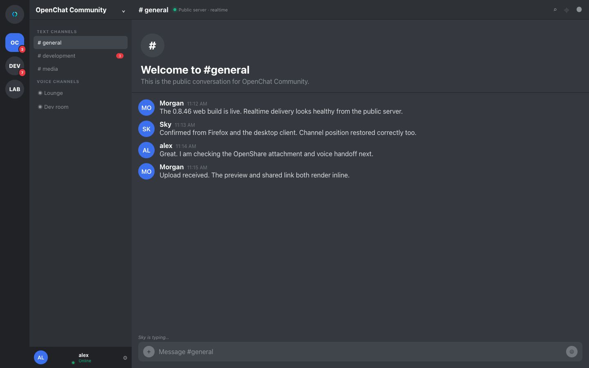
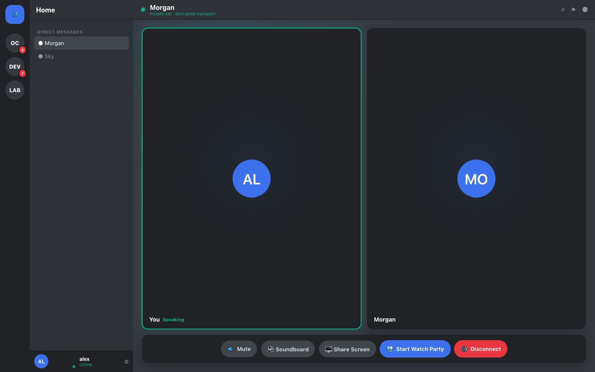
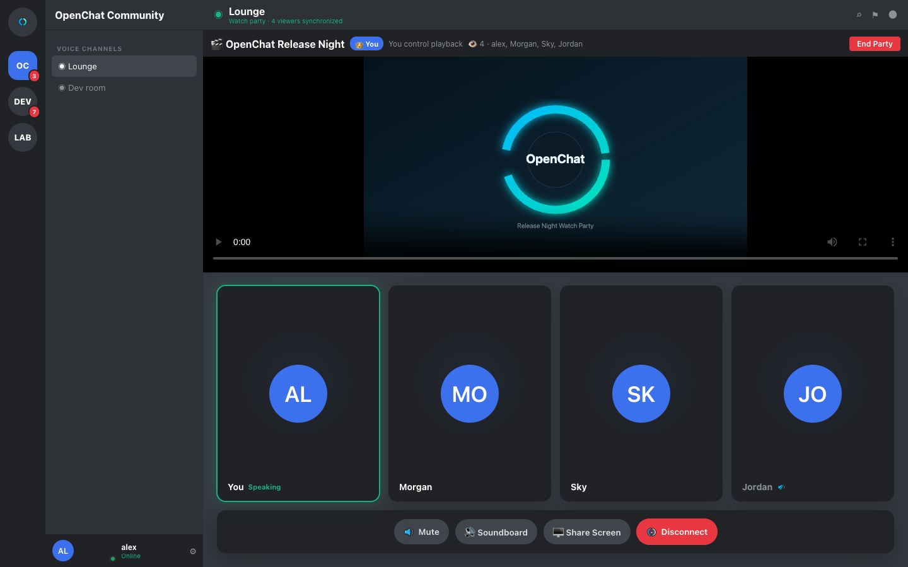
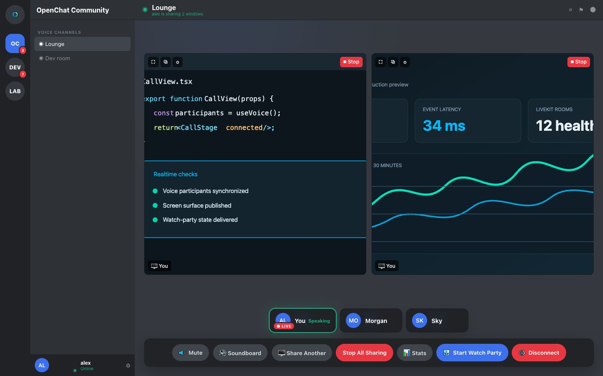

<p align="center">
  
</p>

# OpenChat

A self-hosted communication platform for real-time text and voice/video calls. Built to **integrate** an
existing self-hosted stack — an OpenID Connect provider (e.g. Authentik) for SSO,
**[OpenShare](https://github.com/MinionEnjoyer/OpenShare)** for file uploads & media, and (optionally)
Jellyfin for watch parties — rather than reinvent them.

> **OpenShare is the companion file service.** Deploy it alongside OpenChat and point
> `SHARE_BASE_URL` at it to enable image/file attachments, avatars, and inline embeds. OpenChat also
> runs fine without it (upload UI simply hides). Setup: **[docs/SETUP.md](docs/SETUP.md)**.

Everything environment-specific
(domains, IPs, keys, passwords) is supplied through a single local config file — see
**[docs/SETUP.md](docs/SETUP.md)**.
> **Current production release:** desktop/web UI **0.8.48**. The current desktop installers
> for macOS, Linux, and Windows are on the
> [Releases](https://github.com/MinionEnjoyer/OpenChat/releases/latest) page. The hosted web/API
> deployment follows CI-passing `main`, so it can contain newer backend or test-only commits without
> changing the desktop version.

## Screenshots

The feature captures below are generated from the development showcase harness using the same
React message, call, watch-party, and screen-share components shipped by the web and desktop
clients. Realtime state changes are exercised by the web test suite before capture.

| Public server activity | Private call |
|---|---|
|  |  |

| Synchronized watch party | Multiple shared windows |
|---|---|
|  |  |

## Support

If OpenChat is useful to you, project support is available through
[Buy Me a Coffee](https://buymeacoffee.com/minionenjoyer).

## Features

- **Servers, channels & folders** — text + voice channels; drag-to-reorder servers and
  drag-to-create folders in the sidebar, persisted per user.
- **Messaging** — optimistic send, replies, edits, reactions, emoji, GIFs (Giphy), stickers,
  link/image/YouTube/Share embeds, polls, and **pinned messages** with a per-channel pins panel.
- **Conversation continuity** — each channel synchronously records the visible message and exact
  pixel offset before navigation, then restores that viewport on return; the default `general`
  channel also carries server-owned join/leave activity.
- **Files & media** — attach files via a menu or **drag-and-drop onto the window**, record a
  **voice clip** in-app, click images to **enlarge** in a lightbox, and a custom **audio player**
  with a waveform + scrubbing (analysis is brokered through the OpenChat API to OpenShare).
- **Mentions** — `@user`, plus `@here` / `@everyone` gated behind a `MENTION_EVERYONE`
  permission, with live toast + unread notifications.
- **Voice & video** — self-hosted LiveKit SFU. Always-on voice channels, multi-window
  **screen sharing** (with a live viewers list), a per-server **soundboard**, speaking/mute
  indicators, **voice-activity or push-to-talk** input modes (with a global PTT hotkey on
  desktop), and per-user **mic + speaker + output-volume** settings.
- **Presence & status** — live online/offline for friends and server members, a one-click
  status picker (Online / Away / Do Not Disturb / Invisible), and **auto-away** after idle.
- **OpenShare contact links** — a contact card in a configured OpenShare companion can open the
  Friends screen with an OpenChat username or 8-digit friend code prefilled. The user still
  confirms the request, and no address-book fields are transferred to OpenChat. See
  [OpenShare contact links](docs/guides/OPENSHARE_CONTACT_LINKS.md) for configuration and security details.
- **User-to-user calling** — ring a friend in a DM; incoming-call prompt with accept/decline
  and an in-conversation call banner.
- **Watch parties** — host-synced **Jellyfin or YouTube** playback inside a voice channel:
  host-only controls, a host badge and viewers list, and a Jellyfin browser filtered by
  movies / shows / music.
- **Desktop apps** — native **Windows, macOS, and Linux** clients (Tauri) with tray,
  notifications, global push-to-talk, drag-and-drop, and signed auto-updates. See
  **[apps/desktop/README.md](apps/desktop/README.md)**.
- **Multi-domain clients** — the web and desktop Settings → Servers tab remembers authenticated
  OpenChat domains and switches the entire client between them.
- **Centered client actions** — channel tools, media pickers, message actions, and server
  create/join flows share a keyboard-accessible centered dialog surface on desktop and web mobile.
- **Creator membership invitations** — server owners can optionally verify a supporter&apos;s current
  Patreon membership and share a one-use, expiring OpenChat invitation without retaining Patreon
  access tokens.
- **Trusted mirror clusters** — operators can opt into authenticated, persistent message
  replication across a private group of OpenChat hosts for self-hosted service continuity.
- **Roles & permissions** — bitfield permissions with a data-driven role editor.
- **Real-time everything** — WebSocket gateway + Redis pub/sub; presence, typing,
  notifications, and friend/member lists update live (optimistic UI throughout).
- **Mobile-tuned** — responsive layout, off-canvas drawer, dynamic-viewport sizing so the
  composer stays above the keyboard, and a dedicated send button.

## Tech stack

- **Frontend:** React 18 + TypeScript, Vite, Zustand, `livekit-client`. Static build served by nginx.
- **Backend:** NestJS 11 (Node 20), Prisma 5, PostgreSQL 16, Redis 7 (ioredis), raw `ws` gateway.
- **Auth:** Authentik OIDC (Auth Code + PKCE), server-side Redis sessions.
- **Voice:** self-hosted LiveKit (WebRTC SFU), single-UDP-port mux for NAT stability.
- **Deploy:** Docker Compose behind an existing reverse proxy (Nginx Proxy Manager).

## Repository layout

```
apps/api            NestJS + Prisma backend (auth/OIDC, servers, channels, messages,
                    realtime WS gateway, voice, gifs, watch parties, Share client)
apps/web            React + Vite frontend (single-page app, calls /api same-origin)
apps/desktop        Tauri v2 desktop client (Win/macOS/Linux) bundling apps/web
apps/mobile         Expo/React Native mobile client (Android/iOS; separately versioned)
docker-compose.yml  postgres + redis + api + web + livekit
livekit.yaml.tmpl   LiveKit config template (rendered to livekit.yaml from .env)
.env.example        the ONE config file — copy to .env and fill in
scripts/            setup.sh (render config) · check-secrets.sh (pre-push) · deploy.sh (pull+build)
docs/               current guides, operational runbooks, and preserved evidence/history
```

## Quick start

```bash
cp .env.example .env      # fill in every CHANGE_ME
./scripts/setup.sh        # renders livekit.yaml from .env
docker compose up -d --build
```

### Public containers

Release images for AMD64 and ARM64 are published to the GitHub Container Registry only after the
exact `main` commit passes CI. A configured Docker Hub mirror receives the exact verified image
digest and the same `latest`, version, and `sha-<commit>` tags. After configuring `.env` and
rendering `livekit.yaml`, start the published API and web images with:

```bash
docker compose -f docker-compose.public.yml pull
docker compose -f docker-compose.public.yml up -d
```

The Compose file defaults to `ghcr.io/minionenjoyer/openchat-api:latest` and
`ghcr.io/minionenjoyer/openchat-web:latest`. Set `OPENCHAT_VERSION=0.8.48` to pin the current
client-compatible release, or use a published `sha-<commit>` tag for an immutable deployment.
To use Docker Hub, set `OPENCHAT_API_IMAGE=<namespace>/openchat-api` and
`OPENCHAT_WEB_IMAGE=<namespace>/openchat-web`. PostgreSQL, Redis, and LiveKit remain standard
upstream images.

The Docker Hub API and web overview pages are maintained in `docs/dockerhub/` and synchronized by
the same CI-gated publication workflow, including their short descriptions and deployment guidance.

Full instructions — including OIDC/Share/LiveKit prerequisites, local dev, pushing to git,
and git-based redeploys — are in **[docs/SETUP.md](docs/SETUP.md)** and
**[docs/DEPLOY.md](docs/DEPLOY.md)**.

Optional integrations are documented in
**[Patreon invitations](docs/guides/PATREON_INVITES.md)** and
**[trusted mirror clusters](docs/guides/TRUSTED_MIRROR_CLUSTER.md)**.

The maintained-document index in **[docs/README.md](docs/README.md)** distinguishes current
operator guidance from dated audits, signoffs, decisions, and handoff records that intentionally
describe earlier repository states.

## Verification

API tests enforce a 75% global line-coverage floor. The web client has separate Vitest component
and Playwright browser gates; the browser suite exercises the production React app in desktop and
mobile Chromium with deterministic service fixtures. See
**[web browser testing guide](docs/guides/WEB_BROWSER_TESTING.md)** for commands, covered flows, and the
deployment-E2E boundary.

## Configuration & secrets

All personal data (API keys, tokens, IPs, passwords) lives **only** in the local, gitignored
`.env` (and the `livekit.yaml` it renders). Committed files contain generic placeholders and
public reference values only. `./scripts/check-secrets.sh` verifies nothing sensitive is tracked
before you push.
