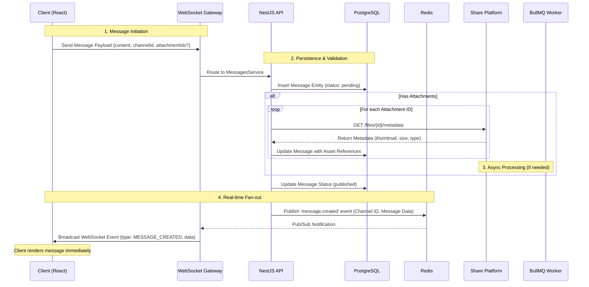
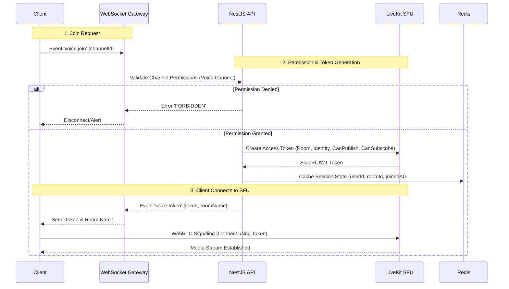
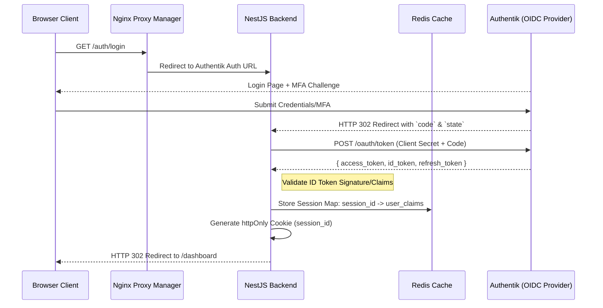
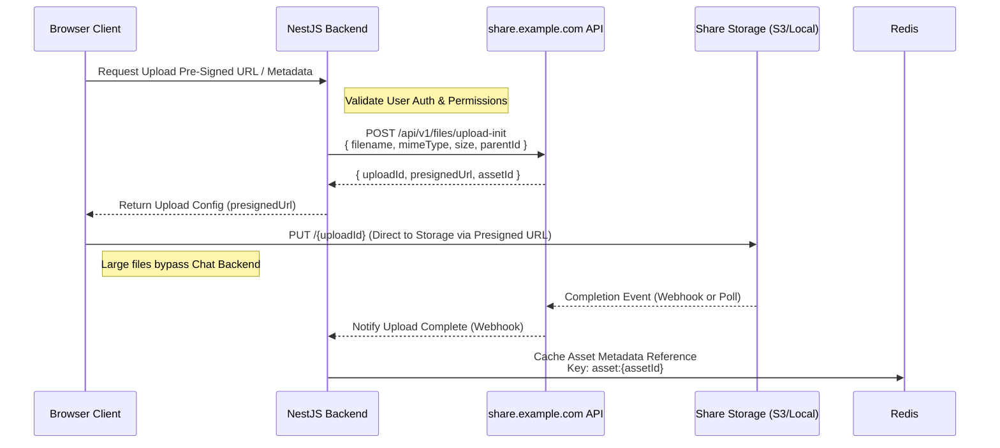
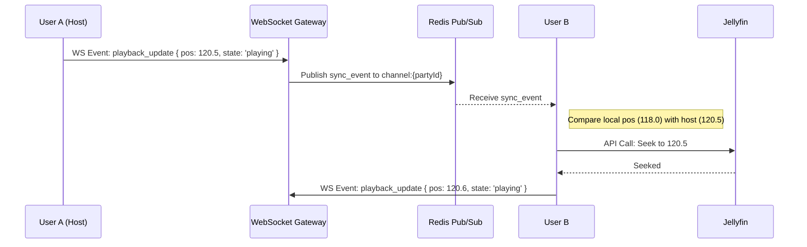
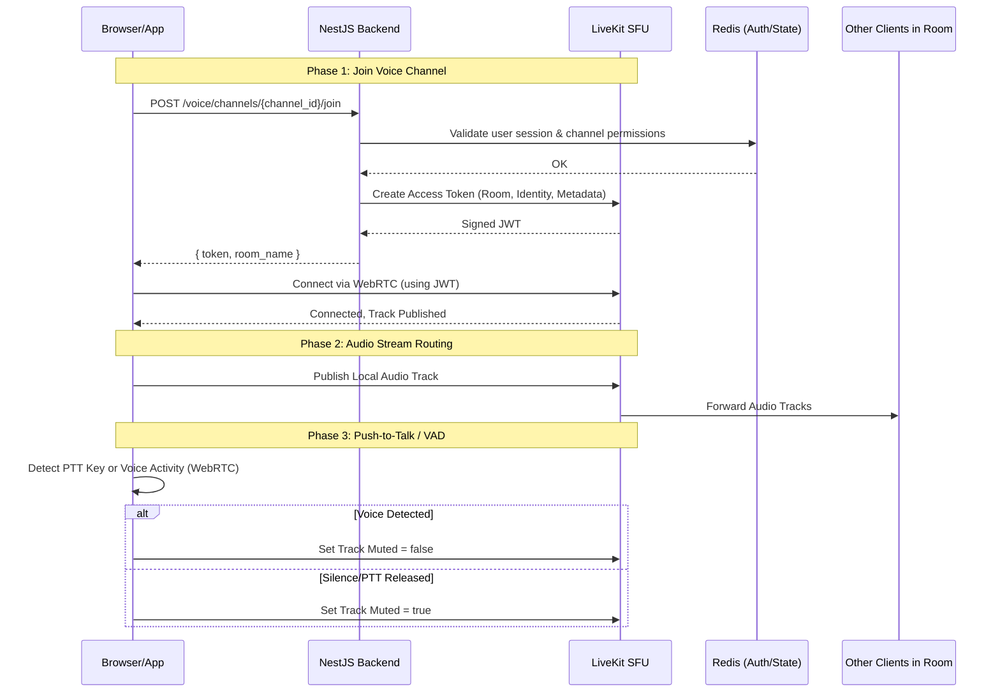

# Architecture Document

_Production architecture for the OpenChat ecosystem's communication hub — a self-hosted platform integrating Authentik (identity).


> Status: **Draft v1** · Scope: Version 1 (V1) architecture + phased roadmap.


## Table of Contents

1. [Foundations: Executive Summary & Technology Recommendations](#foundations-executive-summary--technology-recommendations)
2. [System Architecture: High-Level, Components, Data Flow & Events](#system-architecture-high-level-components-data-flow--events)
3. [Authentication, Share & Jellyfin Integration Architecture](#authentication-share--jellyfin-integration-architecture)
4. [Realtime Messaging & Voice Architecture](#realtime-messaging--voice-architecture)
5. [Database Design & API Specifications](#database-design--api-specifications)
6. [Deployment, Docker Compose, Security, Backup & Observability](#deployment-docker-compose-security-backup--observability)
7. [Repository Structure, Dev Workflow, Standards, Testing & CI/CD](#repository-structure-dev-workflow-standards-testing--cicd)
8. [Roadmaps, Risk Analysis, Libraries & Extensibility](#roadmaps-risk-analysis-libraries--extensibility)

---

# Foundations: Executive Summary & Technology Recommendations

---

## 1. Guiding Principles

The following principles govern all architectural decisions:

1.  **Zero Duplication of Core Domains:** Chat never stores file bytes, manages user passwords, or streams media directly from source. It references and orchestrates existing services.
2.  **Type Safety End-to-End:** Shared TypeScript interfaces between Frontend and Backend reduce integration bugs and simplify API contracts.
3.  **Stateless Compute, Stateful Data:** Application servers (API/WS) must be horizontally scalable and stateless. All session state, presence data, and real-time fan-out are delegated to Redis. Database holds persistent domain entities.
4.  **Security by Default:** Authentication is handled exclusively via OIDC with PKCE. File access is mediated through Share’s permission model. WebSocket connections require signed tickets. CSP and CORS are strictly configured.
5.  **Observability First:** Structured JSON logging, Prometheus metrics, and distributed tracing hooks are embedded in the core framework to integrate seamlessly with the existing homelab monitoring stack (Prometheus/Grafana/Loki).

---

## 3. Technology Recommendations & Justifications

### 3.1 Frontend Layer
**Recommendation:** React 18 + TypeScript, Vite, Tailwind CSS + Radix UI, Zustand, TanStack Query, PWA.

*   **Justification:**
    *   **React 18 + TypeScript:** Provides a mature component model with strict type checking. The shared types (via `tRPC`-like patterns or generated clients) ensure the backend API contract is enforced at compile time on the client.
    *   **Vite:** Offers near-instant HMR and optimized production builds, critical for developer velocity in a self-hosted project where iteration speed matters.
    *   **Tailwind CSS + Radix UI:** Tailwind allows rapid, consistent styling without heavy CSS bundles. Radix UI provides unstyled, accessible primitives (popovers, dialogs, tabs) that match complex, modern UI patterns while allowing full customization via Tailwind. This avoids the bloat of pre-styled libraries like Material-UI or Ant Design.
    *   **Zustand:** Chosen over Redux for its minimal boilerplate and superior performance in managing ephemeral client state (e.g., open modals, local typing indicators). It pairs cleanly with React hooks.
    *   **TanStack Query:** Essential for server-state management. It handles caching, background refetching, and optimistic updates for messages and read receipts, reducing the complexity of manual WebSocket event handling for data synchronization.
    *   **PWA (Service Worker):** Enables offline access to recent message history and cached assets, providing a native-app-like feel on mobile devices without requiring a separate iOS/Android codebase initially.

*   **Alternatives Rejected:**
    *   *Angular:* Too verbose and opinionated for the dynamic, event-driven nature of chat UIs.
    *   *Vue 3:* A strong contender, but React’s ecosystem (especially Radix/UI integration) is more mature for building complex, accessible component libraries required for a rich, modern chat interface.

### 3.2 Backend Layer
**Recommendation:** NestJS (Node.js 20 + TypeScript), Prisma ORM.

*   **Justification:**
    *   **NestJS:** Provides a structured, module-based architecture that scales well from MVP to enterprise complexity. Its dependency injection container and decorator-based routing make it ideal for managing the complex interactions between Auth, Files, Voice, and Media modules. It enforces clean separation of concerns (Controllers -> Services -> Repositories).
    *   **Node.js 20:** Leverages modern V8 features and stable ESM support. The non-blocking I/O model is well-suited for high-concurrency WebSocket connections and API requests.
    *   **Prisma ORM:** Offers type-safe database access, auto-generated clients for the frontend, and excellent migration management. It simplifies complex relational queries (e.g., fetching a channel with nested messages, threads, and permissions) compared to raw SQL or query builders like Knex.

*   **Alternatives Rejected:**
    *   *Express.js:* Lacks built-in structure, leading to "spaghetti code" in large applications. NestJS provides the necessary scaffolding for a multi-module system.
    *   *Go/Rust:* While faster, they lack the rapid development velocity and rich ecosystem of libraries (especially for WebSocket handling and OIDC integration) available in Node.js/NestJS for this specific use case. The performance bottleneck is unlikely to be CPU-bound but rather I/O or Network-bound, which Node handles well with proper scaling.

### 3.3 Database Layer
**Recommendation:** PostgreSQL 16.

*   **Justification:**
    *   **Relational Integrity:** Chat data (Servers, Channels, Users, Messages) is highly relational. PostgreSQL ensures ACID compliance for critical operations like transactional message posting and permission updates.
    *   **JSONB Support:** Allows flexible storage of message metadata, embeds, and reaction counts without schema migrations for every minor feature addition.
    *   **Full-Text Search:** Built-in GIN indexes on JSONB and tsvector columns enable efficient search across messages and file metadata without needing a separate Elasticsearch instance for V1.
    *   **PostGIS (Optional):** Not required for V1, but available if location-based features are added later.

*   **Alternatives Rejected:**
    *   *MongoDB:* Lacks the strict relational integrity needed for complex permission hierarchies and transactional consistency between messages and read receipts.
    *   *SQLite:* Unsuitable for horizontal scaling and high-concurrency write loads expected in a production chat platform.

### 3.4 Realtime Transport & Caching
**Recommendation:** Redis 7 (Pub/Sub, Streams, Cache).

*   **Justification:**
    *   **Redis Pub/Sub Adapter:** Enables horizontal scaling of WebSocket servers. When Server A receives a message, it publishes to Redis; all WS gateways subscribe and fan out the event to connected clients in their respective rooms. This decouples the message processing logic from the connection handling.
    *   **Presence & Cache:** Redis is the single source of truth for user presence (online/idle/dnd) and session storage. Its sub-millisecond latency ensures real-time updates are instantaneous.
    *   **Rate Limiting:** Redis-based sliding window rate limiters protect the API from abuse without storing state on application servers.

*   **Alternatives Rejected:**
    *   *Kafka/RabbitMQ:* Overkill for V1 single-node deployment. Redis Pub/Sub is sufficient for fan-out and simpler to operate within Docker Compose.
    *   *In-Memory Stores (Node Map):* Does not support horizontal scaling.

### 3.5 Background Jobs
**Recommendation:** BullMQ (Redis-backed).

*   **Justification:**
    *   **Reliability:** BullMQ provides job persistence, retries with exponential backoff, and delayed execution via Redis. This is critical for tasks like sending email notifications, processing webhook integrations, or cleaning up stale voice sessions.
    *   **Integration:** Native support for NestJS modules simplifies worker implementation.

*   **Alternatives Rejected:**
    *   *Node-Cron:* Lacks persistence and retry logic; jobs are lost on server restart.
    *   *Celery (Python):* Unnecessary complexity to introduce a Python stack when Node.js can handle background tasks efficiently with BullMQ.

### 3.6 Voice & Media (SFU)
**Recommendation:** LiveKit (Self-Hosted).

*   **Justification:**
    *   **WebRTC SFU Expertise:** Building a reliable WebRTC Selective Forwarding Unit (SFU) from scratch is extremely complex, involving NAT traversal, congestion control, and packet loss recovery. LiveKit provides a production-ready, open-source SFU that handles these complexities.
    *   **Token Minting:** The Chat backend generates short-lived JWTs for LiveKit access, ensuring secure, time-bound room entry without exposing LiveKit credentials to the client.
    *   **Extensibility:** LiveKit supports screen sharing and recording out-of-the-box, aligning with the requirement to defer streaming features but keep them architecturally accessible.

*   **Alternatives Rejected:**
    *   *Janus/GStreamer:* Lower-level frameworks requiring significant custom development for application logic.
    *   *Jitsi Videobridge:* Heavier resource footprint and less flexible API integration compared to LiveKit’s modern SDKs.

### 3.7 Authentication & Security
**Recommendation:** Authentik (OIDC Authorization Code + PKCE).

*   **Justification:**
    *   **Single Source of Truth:** Leverages existing user identities, MFA, and group memberships from Authentik. No password hashing or session management logic needed in Chat.
    *   **PKCE:** Prevents authorization code interception attacks, essential for public clients (SPA/PWA).
    *   **Back-Channel Logout:** Ensures that when a user logs out of Authentik, their Chat session is invalidated immediately, maintaining security consistency.

*   **Alternatives Rejected:**
    *   *JWT Self-Signed:* Violates the principle of delegating identity to Authentik. Increases risk of token forgery and complicates logout/sync.
    *   *Local Database Auth:* Duplicates functionality already provided by Authentik, violating the "Zero Duplication" principle.

---

## 4. Architecture Overview Diagram

```mermaid
graph TB
    subgraph Client ["Browser / PWA"]
        UI[React + Radix UI]
        WS[WebSocket Client]
        SW[PWA Service Worker]
    end

    subgraph Ingress ["Reverse Proxy (NPM)"]
        NPM[Nginx Proxy Manager]
    end

    subgraph ChatService ["chat.example.com (Docker Compose)"]
        API[NestJS REST API]
        WS_GW[WebSocket Gateway]
        Workers[BullMQ Workers]
        
        subgraph State ["Redis 7"]
            Cache[(Cache/Session)]
            PubSub[(Pub/Sub)]
            Streams[(Streams/Jobs)]
        end
        
        DB[(PostgreSQL 16)]
    end

    subgraph Voice ["LiveKit SFU"]
        LiveKit[LiveKit Server]
    end

    subgraph ExternalServices ["Existing Ecosystem"]
        Authentik[Authentik (OIDC Provider)]
        Share[share.example.com (Files/Previews)]
        Jellyfin[Jellyfin (Media)]
    end

    Client -->|HTTPS/WSS| NPM
    NPM --> API
    NPM --> WS_GW
    
    API --> DB
    API --> Cache
    API --> Streams
    Workers --> Streams
    Workers --> DB
    
    WS_GW <--> PubSub
    WS_GW --> LiveKit
    
    API -->|OIDC Auth| Authentik
    API -->|File Ops/Previews| Share
    API -->|Watch Party Sync| Jellyfin
    
    UI -->|Direct File Viewers| Share
```

This architecture ensures that OpenChat remains lightweight, focused on communication logic, and deeply integrated with the existing self-hosted infrastructure without duplicating core capabilities.


---

# System Architecture: High-Level, Components, Data Flow & Events

## 1. High-Level Architecture

The system is deployed via Docker Compose on the host. It sits behind Nginx Proxy Manager (NPM), which terminates TLS and routes traffic based on hostnames. The backend consists of a NestJS monolith split into logical modules, communicating with PostgreSQL for persistence and Redis for real-time state. LiveKit handles WebRTC media; Authentik handles identity; Share handles files; Jellyfin handles media libraries.

```mermaid
graph TB
    subgraph "Client Layer"
        Browser[Web Client<br/>React + Vite + PWA]
        Mobile[Mobile App<br/>Future Phase]
    end

    subgraph "Network Edge (Host)"
        NPM[Nginx Proxy Manager<br/>TLS Termination & Routing]
    end

    subgraph "Chat Services (Docker Compose)"
        direction TB
        
        subgraph "Frontend"
            Static[Static Assets<br/>Nginx Container]
        end

        subgraph "Backend Core"
            API[NestJS API Gateway<br/>REST + WebSocket]
            Workers[BullMQ Workers<br/>Background Jobs]
        end

        subgraph "Real-time & State"
            Redis[(Redis 7)<br/>Pub/Sub, Cache, Rate Limit]
        end

        subgraph "Persistence"
            PG[(PostgreSQL 16)]
        end
    end

    subgraph "External Services (Existing)"
        Auth[Authentik<br/>OIDC Provider]
        Share[Share Platform<br/>File Storage & Previews]
        Jellyfin[Jellyfin<br/>Media Streaming]
        LiveKit[LiveKit SFU<br/>Voice/Video Signaling & Media]
    end

    subgraph "Observability (Shared)"
        Prom[Prometheus]
        Grafana[Grafana]
        Loki[Loki + Promtail]
    end

    Browser -->|HTTPS/WSS| NPM
    Static -->|Served by| API
    
    NPM -->|/api, /ws| API
    NPM -->|/livekit*| LiveKit
    
    API -->|OIDC Auth| Auth
    API -->|REST| Share
    API -->|REST| Jellyfin
    API -->|gRPC/HTTP| LiveKit
    
    Workers -->|REST| Share
    Workers -->|REST| Jellyfin
    
    API <-->|TCP| Redis
    API <-->|TCP| PG
    Workers <-->|TCP| Redis
    Workers <-->|TCP| PG
    
    API -.->|Metrics/Logs| Prom
    API -.->|Structured Logs| Loki
```

## 2. Component Breakdown: Backend Modules

The NestJS backend is structured using a modular architecture. Each module owns its domain logic, database entities, and DTOs. Cross-cutting concerns (Auth, Logging, Validation) are handled via global interceptors/guards.

### Core Modules

| Module | Responsibility | Key Dependencies |
| :--- | :--- | :--- |
| `AppModule` | Root module, Global Interceptors, Guards, Config. | `ConfigService`, `PrismaService` |
| `AuthModule` | OIDC Session management, Ticket minting for WS. | `Passport`, `Redis`, `LiveKitService` (for tickets) |
| `UsersModule` | User preferences, presence status, profile metadata. | `Prisma`, `Redis` (Presence) |
| `ServersModule` | Server CRUD, Category/Channel hierarchy. | `Prisma` |
| `MembershipsModule` | Invites, Roles, Permissions inheritance resolution. | `Prisma`, `RBAC Service` |
| `MessagesModule` | Text messages, edits, deletes, pins. | `Prisma`, `Redis` (Cache), `ShareService` |
| `ThreadsModule` | Thread creation, reply aggregation. | `Prisma` |
| `ReactionsModule` | Emoji reactions on messages/threads. | `Prisma` |
| `VoiceModule` | LiveKit token generation, session state management. | `LiveKit SDK`, `Redis` (Session State) |
| `WatchPartyModule` | Jellyfin sync room logic, playback commands. | `JellyfinService`, `Redis` (Sync Clock) |
| `FilesModule` | Share asset references, metadata caching. | `ShareService`, `Prisma` |
| `NotificationsModule` | In-app notification queue, browser push config. | `BullMQ`, `Prisma` |
| `IntegrationsModule` | Generic adapter for future services (e.g., Game Servers). | `Adapter Interface` |

### Infrastructure Modules

| Module | Responsibility | Key Dependencies |
| :--- | :--- | :--- |
| `RedisModule` | Connection pooling, Pub/Sub client, Rate Limiter. | `ioredis`, `RateLimiterRedis` |
| `LiveKitModule` | SFU connection, token generation, room management. | `livekit-server-sdk` |
| `ShareService` | HTTP client wrapper for Share API (uploads, metadata). | `Axios`, `Config` |
| `JellyfinService` | HTTP client wrapper for Jellyfin API (metadata, playback). | `Axios`, `Config` |

## 3. Data Flow Diagrams

### 3.1 Sending a Message (Text with Attachment)

This flow demonstrates the separation of concerns: Chat handles message metadata and routing; Share handles file persistence and preview generation.



**Key Design Decisions:**
*   **Upload Separation:** The client uploads files to Share (via presigned URLs or direct API) *before* sending the chat message. The Chat backend only receives references. This ensures Chat never stores binary data.
*   **Latency:** The WebSocket broadcast happens immediately after DB commit. If metadata fetching from Share is slow, it can be done asynchronously via BullMQ to avoid blocking the write path, but for V1, synchronous fetch of metadata (cached in Redis) is preferred for consistency.

### 3.2 Voice Channel Join & LiveKit Token Minting

This flow ensures secure, short-lived access to the WebRTC infrastructure without exposing credentials to the client.



**Key Design Decisions:**
*   **Token Scope:** The LiveKit token is scoped strictly to the specific room and user permissions (e.g., can publish audio but not video, unless future phases add it).
*   **State Sync:** Redis tracks who is in which voice channel for presence indicators (avatars moving) without querying Postgres.

## 4. Event Architecture & Reliability

To ensure horizontal scalability of the WebSocket gateway and reliable delivery of events, we utilize a dual-layer event system: **Redis Pub/Sub** for real-time fan-out and **Redis Streams + Outbox Pattern** for durable background processing.

### 4.1 Real-Time Fan-Out (Redis Pub/Sub)

The WebSocket Gateway instances connect to Redis as subscribers. When an API service publishes an event, all WS gateways receive it and broadcast to connected clients in the relevant channel/scope.

*   **Channel Naming Convention:** `chat:events:{scope}:{id}`
    *   Example: `chat:events:channel:123` (for a message in channel 123)
    *   Example: `chat:events:user:456` (for presence updates for user 456)
*   **Mechanism:**
    1.  Backend Service publishes JSON payload to Redis Pub/Sub channel.
    2.  All WS Gateway instances receive the message.
    3.  Each Gateway filters clients based on their subscription map (stored in Redis Hash `chat:ws:subscriptions`).
    4.  Only relevant clients are pushed the data.

### 4.2 Domain Events & Outbox Pattern (Redis Streams)

For actions that require side effects (e.g., sending browser notifications, updating search indexes, logging audit trails), we use an outbox pattern to ensure exactly-once processing semantics and decouple the transactional DB write from the event consumption.

**Flow:**
1.  **API Transaction:** The NestJS service writes the domain entity (e.g., `Message`) to PostgreSQL *and* inserts a record into the `outbox_events` table within the same database transaction.
2.  **Polling Worker:** A dedicated BullMQ worker polls the `outbox_events` table for unprocessed records.
3.  **Stream Publishing:** The worker publishes the event payload to a Redis Stream (`chat:streams:domain`) and marks the outbox record as processed.
4.  **Consumers:** Other services (e.g., Notification Service, Search Indexer) consume from the Redis Stream.

**Event Schema (Redis Stream Entry):**

```json
{
  "event_id": "uuid-v4",
  "aggregate_type": "Message",
  "aggregate_id": "msg-123",
  "action": "CREATED",
  "timestamp": "2023-10-27T10:00:00Z",
  "payload": {
    "channelId": "ch-456",
    "userId": "usr-789",
    "content": "Hello World"
  }
}
```

**Key Consumers:**
*   **Notification Service:** Listens to `Message.CREATED`. Checks user mute settings. If valid, creates a push notification job via BullMQ or updates browser notification state.
*   **Audit Logger:** Writes to an immutable audit log table for moderation compliance.
*   **Search Indexer (Future):** Updates Elasticsearch/OpenSearch index with new message content.

### 4.3 Presence & Heartbeats

Presence is managed entirely in Redis to minimize DB load.

*   **Key Structure:** `chat:presence:{userId}` -> Hash `{status, lastSeen, customStatus}`
*   **Heartbeat:** Client sends a heartbeat every 15s via WebSocket. Backend updates `lastSeen` and extends TTL (e.g., 60s). If TTL expires, status changes to "Offline" or "Away".
*   **Channel Occupancy:** For voice channels, LiveKit webhooks trigger backend events to update Redis hashes tracking who is in a room (`chat:voice:room:{roomId}:members`).


---

# Authentication, Share & Jellyfin Integration Architecture

This document defines the integration patterns for **Authentik**, share services, and **Jellyfin**. The Chat backend acts as a stateless consumer of these services where possible, maintaining only ephemeral session state and application-specific metadata (messages, channels, presence).

## A. Authentik SSO & Identity Management

Chat does not store passwords or user credentials. It relies entirely on **Authentik** for identity verification, authorization, and session lifecycle management via OIDC Authorization Code + PKCE.

### 1. Authentication Flow (Browser)

The browser initiates an OIDC flow against Authentik. Upon successful authentication (including MFA if required), Authentik redirects back to Chat with an `authorization_code`. The backend exchanges this code for tokens server-side.



### 2. Session & Token Storage Model

*   **Browser**: Stores an `httpOnly`, `Secure`, `SameSite=Lax` cookie named `chat_session`. This contains a UUID referencing the server-side session. No JWTs are stored in client storage.
*   **Redis**: Acts as the single source of truth for active sessions and token refresh logic.
    *   Key: `session:{uuid}`
    *   Value (JSON):
        ```json
        {
          "userId": "authentik-user-uuid",
          "email": "user@domain.com",
          "displayName": "John Doe",
          "groups": ["admin", "members"],
          "roles": ["MODERATOR"],
          "accessToken": "...", // Short-lived, used for API introspection if needed
          "refreshToken": "...", // Long-lived, stored encrypted at rest in Redis (if persisted) or ephemeral
          "expiresAt": 1715623400,
          "lastActive": 1715623000
        }
        ```
*   **Silent Refresh**: The frontend uses a hidden iframe or `fetch` with credentials to hit `/api/auth/refresh`. If the refresh token is valid in Redis, new tokens are minted and the session TTL is extended.

### 3. WebSocket Authentication

WebSocket connections must be authenticated before any data is exchanged. We use a **Ticket-Based** approach to avoid sending cookies over WS (which can be problematic with CORS/Proxy setups) and to allow short-lived, scoped access.

1.  Client requests a ticket: `POST /api/ws/ticket` (requires valid HTTP session cookie).
2.  Backend validates session in Redis, generates a signed JWT (or HMAC string) containing `userId`, `serverId`, and expiration (e.g., 5 minutes).
3.  Backend returns `{ "ticket": "eyJ..." }`.
4.  Client connects: `wss://chat.example.com/ws?ticket=...`.
5.  Backend verifies ticket signature, extracts user context, and binds the socket to the Redis Pub/Sub channel for that user.

### 4. Back-Channel Logout & Session Invalidation

*   **Logout**: When a user clicks "Log Out" in Chat, the frontend calls `POST /api/auth/logout`. The backend invalidates the session in Redis (deletes key) and triggers an OIDC back-channel logout request to Authentik (`/protocol/openid-connect/logout`).
*   **Authentik Logout**: Authentik invalidates its own session. If other services are logged in, they can be notified via back-channel if configured, but Chat primarily relies on the client-side cookie deletion + Redis invalidation for immediate effect.
*   **Force Logout (Admin)**: An admin can revoke a user's session by deleting their key from Redis. The next API/WS request will fail with `401 Unauthorized`.

### 5. Group & Role Mapping

Authentik Groups are mapped to Chat Roles at login time. This mapping is cached in the Redis session object.

| Authentik Group | Chat Role | Permissions |
| :--- | :--- | :--- |
| `chat-admins` | `ADMIN` | Full access, manage servers, delete any message, audit logs. |
| `chat-moderators` | `MODERATOR` | Delete messages, mute users, manage channels (within assigned servers). |
| `chat-members` | `MEMBER` | Standard read/write access to public channels. |

*   **Dynamic Updates**: If a user's group membership changes in Authentik, the change takes effect on their next login or token refresh. There is no real-time sync of group membership for active sessions (acceptable trade-off for self-hosted scale).

---

## B. Sharing Service Integration Architecture

Chat treats the sharing service as the sole authority for file storage, metadata, and rendering. Chat stores only references (IDs/URLs) to assets hosted in Share.

### 1. Upload Flow

Files are never uploaded to Chat's backend or storage. The upload occurs directly from the client to Share, orchestrated by Chat.



*   **Presigned URLs**: To minimize backend load and bandwidth, Chat requests a presigned upload URL from Share. The client uploads directly to the storage layer associated with Share.
*   **Webhooks**: Share sends a webhook to `POST /api/webhooks/share/upload-complete` upon successful upload. This ensures Chat knows when an asset is ready for embedding in messages.

### 2. Attachment References & Embedding

Messages contain references to Share assets, not the files themselves.

**Database Schema (Prisma):**
```prisma
model Message {
  id        String   @id @default(uuid())
  content   String?
  assetId   String?  // Reference to share.example.com Asset ID
  
  // Relations
  channel   Channel  @relation(fields: [channelId], references: [id])
  channelId String
  
  // Metadata cached for performance (denormalized)
  assetName String?
  assetType String? // image, video, pdf, etc.
}
```

**Embedding Viewers:**
When a message contains an `assetId`, the frontend constructs the Share Viewer URL:

*   **Auth**: The viewer is accessed via a signed token or session cookie passed through the iframe, ensuring the user has permission to view the file. Chat does not manage these permissions; it relies on Share's existing auth flow.
*   **Security**: Iframes are sandboxed with `allow-scripts allow-same-origin` only if necessary for specific viewers, but generally restricted to prevent XSS from untrusted content.

### 3. Permission Enforcement

Chat never bypasses Share's permission checks.
1.  **Upload**: User must have `write` access to the target folder in Share (verified via Share API token).
2.  **View**: The frontend requests a preview URL from Share. If Share returns `403 Forbidden`, Chat displays "Access Denied" instead of the viewer.
3.  **Delete**: Messages can be deleted, but this only removes the *reference* in Chat. To delete the actual file, the user must have permission in Share, and Chat calls `DELETE /api/v1/files/{assetId}` on Share's API.

### 4. Rich Embeds & SSRF Protection

When a URL is pasted into a message, Chat unfurls it to generate a rich embed (OG tags).

*   **Share Links**: If the URL matches the sharing service domain, Chat calls Share's metadata API (`GET /api/v1/files/{id}/metadata`) instead of fetching the HTML. This is faster and safer.
*   **External URLs**: For external links, the backend fetches the HTML using a safe HTTP client with:
    *   IP Allowlisting (only allow known domains).
    *   SSRF Protection: Block private IPs (`10.x`, `127.x`, etc.) during DNS resolution and connection.
    *   Timeout limits (5s max).
    *   Max content size limit (1MB max for parsing).

---

## C. Jellyfin Watch Parties Architecture

Watch parties allow synchronized playback of media hosted in **Jellyfin**. Chat does not stream media; it orchestrates the synchronization state.

### 1. Room Model

A "Watch Party" is a logical room linked to a specific Channel and a specific Jellyfin Media Item.

**Database Schema (Prisma):**
```prisma
model WatchParty {
  id          String   @id @default(uuid())
  channelId   String
  mediaId     String   // Jellyfin Item ID
  jellyfinServerUrl String // Reference to the server instance
  
  state       Json     // Current sync state: { position, isPlaying, timestamp }
  
  createdAt   DateTime @default(now())
  updatedAt   DateTime @updatedAt
  
  channel     Channel  @relation(fields: [channelId], references: [id])
}

model WatchPartyParticipant {
  userId      String
  partyId     String
  lastSyncedAt DateTime
  status      String   // 'synced', 'drifting', 'disconnected'
  
  @@id([userId, partyId])
}
```

### 2. Host Authority & Sync Protocol

To prevent race conditions, one user is designated the **Host** for each active watch party. The Host's playback position is the source of truth.

*   **Host Selection**: First user to join becomes Host. If Host leaves, the next most recent participant becomes Host (via Redis distributed lock).
*   **Sync Interval**: Clients send their current playback state (`position`, `isPlaying`) to Chat every 2-3 seconds via WebSocket.
*   **Drift Correction**:
    *   If a client's position deviates by >1 second from the Host, the backend (or frontend logic) issues a "Seek" command to that client.
    *   The backend maintains a sliding window of accepted positions to filter out jitter.

**Sync Flow:**



### 3. Playback Commands

*   **Play/Pause/Seek**: Any user can issue these commands, but they are validated against the Host's authority. If a non-Host tries to seek, the request is forwarded to the Host's client instance for execution (or rejected if the Host is inactive).
*   **Late Joiners**: When a user joins an active party, Chat sends them the current `state` from Redis. The frontend immediately seeks Jellyfin to that position and starts playback.

### 4. Media Access & Auth

*   **Direct Streaming**: Clients connect directly to Jellyfin's streaming endpoint (`/Videos/{id}/stream`). No proxying through Chat.
*   **Authentication**: Jellyfin is already authenticated via Authentik. The client uses its existing Jellyfin session token (stored in browser local storage or cookie) to access media.
*   **Permission Check**: Before creating a watch party, the backend verifies that the user has access to the specific Jellyfin item (via Jellyfin API `GET /Items/{id}`).

### 5. Future Extensibility

The architecture supports adding "Reactions" or "Chat during Watch Party" by extending the WebSocket event payload with custom types (`type: 'reaction'`, `payload: { emoji: '🔥' }`), which are rendered as overlays on the video player without interrupting playback sync.


---

# Realtime Messaging & Voice Architecture

This section defines the real-time communication layer for **chat.example.com**. It covers two distinct subsystems:
1.  **Messaging**: A high-throughput, ordered WebSocket gateway for text, reactions, and presence.
2.  **Voice**: A WebRTC SFU architecture using LiveKit for low-latency audio.

Both systems are designed to scale horizontally via Redis but operate with minimal operational complexity on the single-node the host deployment.

---

## 1. Realtime Messaging Architecture

### 1.1 Protocol Design: WebSocket Gateway

The backend exposes a single WebSocket endpoint at `/ws`. All connections must be authenticated via an OIDC session cookie (set by the NestJS HTTP gateway). The WebSocket upgrade handshake validates this cookie before establishing the connection.

**Connection Lifecycle:**
1.  **Handshake**: Client connects to the session ID.
2.  **Auth Validation**: The Gateway verifies the session ID against Redis. If valid, it retrieves the user's identity (from Authentik claims cached in Redis) and assigns a unique `client_id` (UUID).
3.  **Subscription**: The client subscribes to specific "rooms" (Server IDs or Channel IDs).
4.  **Heartbeat**: Bidirectional ping/pong every 30s. If missed for 90s, the connection is terminated and presence updated to `offline`.

**Horizontal Scaling Strategy:**
The NestJS WebSocket Gateway uses the `@nestjs/platform-socket.io` adapter backed by a **Redis Adapter**. This ensures that:
*   Messages published in one gateway instance are broadcast to all clients connected to *any* instance.
*   Presence state is shared across instances via Redis Hashes.

### 1.2 Message Envelope Schema

All real-time messages follow a strict envelope structure to ensure consistency and allow for future extension (e.g., encryption, compression).

```typescript
interface RealtimeEnvelope {
  // Unique ID generated by client or server depending on context
  id: string; 
  // Timestamp of creation (ISO-8601)
  timestamp: string;
  // The domain event type driving the UI update
  type: MessageType;
  // Payload specific to the message type
  payload: Record<string, any>;
}

enum MessageType {
  MESSAGE_CREATE = 'message:create',
  MESSAGE_UPDATE = 'message:update',
  MESSAGE_DELETE = 'message:delete',
  REACTION_ADD = 'reaction:add',
  REACTION_REMOVE = 'reaction:remove',
  TYPING_START = 'typing:start',
  TYPING_STOP = 'typing:stop',
  READ_ACKNOWLEDGED = 'read:acknowledged'
}
```

### 1.3 Message Flow & Ordering Guarantees

To guarantee message ordering and prevent race conditions during concurrent edits or deletions, we use a **Server-Authoritative Write Model** with optimistic UI updates on the client side.

#### Standard Text Message Flow
1.  **Client**: Composes message → Generates temporary `id` (UUID v4) → Sends `MESSAGE_CREATE` envelope to Gateway.
2.  **Gateway**: Validates auth, checks rate limits (Redis), and publishes event to **Redis Streams** (`chat:events:outbox`).
3.  **Worker Service**: Consumes from `chat:events:outbox`.
    *   Persists message to PostgreSQL.
    *   Generates permanent `id` and `timestamp`.
    *   Updates unread counts for mentioned users (async).
    *   Publishes final event back to Redis Pub/Sub channel (`chat:messages:new`).
4.  **Gateway**: Listens to `chat:messages:new`. Replaces the optimistic message in the client's cache with the server-confirmed version (same `id`, now with permanent metadata).

#### Ordering Logic
*   **Logical Clocks**: Messages within a single channel are ordered by PostgreSQL insertion timestamp.
*   **Gap Recovery**: If a client reconnects, it sends its last seen `message_id`. The Gateway queries PostgreSQL for messages newer than that ID and streams them in order. This avoids the "store-and-forward" bottleneck of keeping full history in memory.

### 1.4 Presence & Typing Indicators

Presence is managed via Redis Hashes to ensure low-latency reads across scaled instances.

**Data Structure:**
```redis
HSET presence:server:{server_id} {user_id} {"status": "online", "last_seen": 1698771234, "client_type": "web"}
HSET presence:channel:{channel_id} {user_id} {"typing": true, "since": 1698771230}
```

**Flow:**
*   **Typing**: Client emits `TYPING_START` when input changes. Gateway sets a TTL of 5 seconds on the Redis key for that user in that channel. If no new typing event arrives within 5s, the worker clears it. This prevents stale "typing..." indicators.
*   **Read State**: When a client scrolls through messages, it sends `READ_ACKNOWLEDGED` with a cursor (timestamp or ID). The Gateway batches these acknowledgments and pushes them to Redis Streams for async persistence in PostgreSQL (`read_receipts` table).

### 1.5 Backpressure & Rate Limiting

To protect the database and WebSocket connections:
*   **Client-Side**: Debounce typing events (300ms); batch read receipts (every 2s or on scroll stop).
*   **Server-Side**: Redis-based sliding window rate limiter per user per channel.
    *   Limit: 10 messages/second, 60 messages/minute.
    *   Exceeding limits returns a `429 Too Many Requests` WS event, prompting the client to throttle UI updates.

---

## 2. Voice Architecture (LiveKit)

Voice is decoupled from the messaging WebSocket to ensure audio stability and leverage WebRTC's native capabilities. We use **LiveKit** as an SFU (Selective Forwarding Unit). LiveKit handles media routing, bandwidth estimation, and congestion control.

### 2.1 High-Level Topology



### 2.2 Token Minting & Security

Security is enforced at the token level. The NestJS backend acts as the trusted issuer for LiveKit tokens.

1.  **Request**: User clicks "Join Voice" in a text channel.
2.  **Validation**: Backend checks if the user has `voice_connect` permission in that specific channel (via Redis cache or DB lookup).
3.  **Token Generation**:
    *   Uses LiveKit's server-side SDK.
    *   **Room Name**: Derived from Channel ID (e.g., `chan_123_voice`).
    *   **Identity**: User's UUID.
    *   **Metadata**: JSON string containing display name, avatar URL, and role tags for client-side UI rendering.
    *   **Permissions**: Grant only `canPublish` (audio) and `canSubscribe`. No room management permissions.
    *   **TTL**: Short-lived (1 hour). Client must re-authenticate if the session expires mid-call.

### 2.3 Joining a Voice Channel

*   **Room Naming Convention**: `{channel_id}_voice`. This ensures each text channel has its own isolated voice room.
*   **Reconnection**: LiveKit client SDK handles automatic reconnection with exponential backoff. If the WebSocket connection to Chat API drops, the user remains in the voice call until they manually leave or the token expires.
*   **Presence Sync**: When a user joins/leaves the LiveKit room, LiveKit emits events to its own webhook endpoint (or via Server-Sent Events). The NestJS backend listens to these, updates the `voice_occupancy` in Redis, and broadcasts this change to the text channel's WebSocket subscribers. This allows the UI to show "3 users online" next to the voice channel icon.

### 2.4 Client-Side Audio Handling (PTT & VAD)

The frontend uses WebRTC's `RTCRtpSender` capabilities combined with a lightweight audio analysis library (e.g., `webrtc-audio-processing` or browser-native Voice Activity Detection).

*   **Push-to-Talk (PTT)**:
    *   Client listens for keydown/keyup events.
    *   On hold: Sets `track.setMuted(true)`.
    *   On release: Sets `track.setMuted(false)`.
    *   *Note*: LiveKit SFU efficiently handles muted tracks by not forwarding them, saving bandwidth.

*   **Voice Activity Detection (VAD)**:
    *   Client runs a local VAD algorithm on the microphone stream.
    *   If voice is detected for >200ms, automatically unmute track.
    *   If silence persists for >500ms, mute track.
    *   This reduces background noise without requiring manual mute/unmute.

### 2.5 Screen Share & Streaming (Future Phase)

The architecture supports screen sharing in **Phase 2** without backend changes:

1.  **LiveKit Capability**: LiveKit SFU natively supports video tracks from `getDisplayMedia()`.
2.  **Client Implementation**: Add a "Share Screen" button that invokes the browser API. The resulting track is published to the same room.
3.  **Permissions**: Backend token generation logic can be extended to grant `canPublish` for video tracks if needed, or simply rely on default permissions.
4.  **Bandwidth Management**: LiveKit's Simulcast/SVC (Scalable Video Coding) will automatically adjust quality based on network conditions, which is critical for self-hosted homelab networks with variable upload speeds.

### 2.6 Deployment Configuration (LiveKit)

In `docker-compose.yml`, LiveKit runs as a standalone service alongside the Chat backend.

```yaml
services:
  livekit:
    image: livekit/livekit-server:latest
    ports:
      - "7880:7880" # HTTP API (for token minting)
      - "7881:7881/udp" # WebRTC UDP port range
      - "7882:7882/tcp" # WebRTC TCP fallback
    environment:
      LIVEKIT_KEYS: "<api_key>:<api_secret>" # Shared secret with NestJS backend
      LIVEKIT_TURN_ENABLED: "false" # Rely on NPM TLS/UDP forwarding for now
      LIVEKIT_TURN_SERVERS: "" 
    volumes:
      - ./livekit/config.yaml:/etc/livekit-server.yaml
```

*   **Firewall**: The existing Nginx Proxy Manager (NPM) must be configured to forward UDP traffic on port `7881` to the LiveKit container. This is a critical requirement for WebRTC NAT traversal in this specific homelab setup. If NPM cannot handle UDP, we may need a dedicated Caddy or Traefik instance for the voice subdomain, but per pinned decisions, we attempt NPM first.

---

## 3. Integration with Existing Services

### 3.1 Authentik SSO Sync
*   **Voice**: No direct sync needed. Voice identity is derived from the OIDC session validated by NestJS. If a user logs out of Authentik, their HTTP cookie expires, and they are disconnected from the WebSocket gateway. They cannot mint new voice tokens.

### 3.2 Share.example.com
*   **Voice**: No integration. Voice traffic is direct WebRTC.
*   **Messaging**: Attachments sent in chat are handled by the standard REST API flow (upload to Share, get ID, send message). The WebSocket layer only transmits the metadata envelope containing the Share Asset ID.

### 3.3 Jellyfin Watch Parties
*   **Voice**: Voice tracks can be included in the same LiveKit room as a watch party, or separate rooms. For V1, we keep them separate to avoid audio mixing complexity. The UI will provide deep links between the "Watch Party" channel and the "Voice Channel."

---

## 4. Error Handling & Resilience

*   **WebSocket Disconnect**: Client detects disconnect via `onclose` event. Enters "Reconnecting..." state. Attempts to reconnect with exponential backoff (1s, 2s, 4s...). Max retries: 5.
*   **Token Expiry**: If LiveKit returns a 403 during token minting or connection, the client redirects to login page.
*   **Database Lag**: If PostgreSQL is slow, the Outbox pattern ensures no messages are lost. The WebSocket gateway never writes directly to DB; it only publishes to Redis Streams. This decouples real-time latency from database write speed.


---

# Database Design & API Specifications

## 1. PostgreSQL Schema (Prisma ORM)

This schema is designed for **PostgreSQL 16**. It uses Prisma conventions for type safety but maps to standard SQL DDL concepts. The design strictly separates Chat-owned data from external references (Authentik, Share, Jellyfin).

### Key Design Decisions
*   **Identity:** `User` table mirrors Authentik users via `auth_sub`. No passwords stored.
*   **Files:** `Attachment` stores only the `share_id`, `mime_type`, and `thumbnail_url`. Binary data is never persisted here.
*   **Permissions:** Uses a composite bitfield approach for channel/server permissions to allow granular control without excessive join tables, while maintaining a `RolePermission` table for role-based inheritance.
*   **Partitioning:** The `Message` table is partitioned by range on `created_at` (monthly) to handle infinite history efficiently.

```prisma
// schema.prisma

generator client {
  provider = "prisma-client-js"
}

datasource db {
  provider = "postgresql"
  url      = env("DATABASE_URL")
}

// -----------------------------------------------------------------------------
// Identity & Core Entities
// -----------------------------------------------------------------------------

model User {
  id            String    @id @default(uuid())
  auth_sub      String    @unique // Authentik OIDC sub
  username      String    @db.VarChar(50)
  display_name  String?   @db.VarChar(100)
  avatar_url    String?   // Optional local override, otherwise from Authentik/Share
  
  status        UserStatus @default(OFFLINE)
  status_note   String?   @db.Text
  last_seen     DateTime  @default(now())

  created_at    DateTime  @default(now()) @map("created_at")
  updated_at    DateTime  @updatedAt @map("updated_at")

  // Relations
  memberships   Membership[]
  messages      Message[]
  reactions     Reaction[]
  read_states   ReadState[]
  voice_sessions VoiceSessionUser[]
  
  @@index([auth_sub])
}

enum UserStatus {
  ONLINE
  IDLE
  DND
  INVISIBLE
  OFFLINE
}

// -----------------------------------------------------------------------------
// Server Model (guild/server)
// -----------------------------------------------------------------------------

model Server {
  id          String   @id @default(uuid())
  name        String   @db.VarChar(100)
  icon_url    String?  // Reference to Share or Authentik avatar
  
  owner_id    String
  owner       User     @relation(fields: [owner_id], references: [id])

  created_at  DateTime @default(now()) @map("created_at")

  categories  Category[]
  
  @@index([owner_id])
}

model Membership {
  id        String   @id @default(uuid())
  server_id String
  user_id   String
  role_ids  String[] // Array of Role IDs assigned to this member
  
  joined_at DateTime @default(now()) @map("joined_at")
  
  server    Server   @relation(fields: [server_id], references: [id])
  user      User     @relation(fields: [user_id], references: [id])

  @@unique([server_id, user_id])
}

model Role {
  id          String   @id @default(uuid())
  server_id   String
  name        String   @db.VarChar(50)
  color       Int      // RGB integer for UI display
  position    Int      // Higher = higher hierarchy
  
  permissions BigInt   // Bitfield: see PermissionFlags enum mapping
  
  members     Membership[]

  @@unique([server_id, name])
}

// -----------------------------------------------------------------------------
// Channels & Categories
// -----------------------------------------------------------------------------

model Category {
  id          String   @id @default(uuid())
  server_id   String
  position    Int
  name        String?  @db.VarChar(100) // Nullable for "uncategorized" or auto-named
  
  channels    Channel[]
  server      Server   @relation(fields: [server_id], references: [id])

  @@index([server_id, position])
}

model Channel {
  id          String   @id @default(uuid())
  type        ChannelType
  name        String   @db.VarChar(100)
  topic       String?  @db.Text
  
  server_id   String
  category_id String?  // Nullable for root-level channels if no categories exist, though usually categorized
  
  position    Int      // Within category or server-wide for voice/text
  
  permission_overwrites PermissionOverwrite[]
  
  messages    Message[]
  threads     Thread[]
  
  created_at  DateTime @default(now()) @map("created_at")

  @@index([server_id, type])
  @@index([category_id])
}

enum ChannelType {
  TEXT
  VOICE
  ANNOUNCEMENT
  PRIVATE_DM // Future: Direct Messages between users (not server-scoped)
}

model PermissionOverwrite {
  id          String   @id @default(uuid())
  channel_id  String
  target_type OverwriteTarget // ROLE or USER
  target_id   String   // ID of the Role or User
  
  allow       BigInt   // Permissions to add
  deny        BigInt   // Permissions to remove

  @@unique([channel_id, target_type, target_id])
}

enum OverwriteTarget {
  ROLE
  USER
}

// -----------------------------------------------------------------------------
// Messaging & Threads
// -----------------------------------------------------------------------------

// Partitioned Table: Messages are partitioned by month for performance.
// In Prisma, this is handled via raw SQL migrations or specific drivers.
// Here we define the logical schema.

model Message {
  id          String   @id @default(uuid())
  
  channel_id  String
  author_id   String
  content     String?  @db.Text
  
  // Rich Content
  embeds      Json[]   // OpenGraph, etc.
  edited_at   DateTime? @map("edited_at")
  deleted_at  DateTime? @map("deleted_at") // Soft delete for audit/visibility control

  // Hierarchy
  parent_id   String?  // If this is a reply/thread message
  
  created_at  DateTime @default(now()) @map("created_at")

  author      User     @relation(fields: [author_id], references: [id])
  
  reactions   Reaction[]
  attachments Attachment[]
  thread      Thread?  @relation(fields: [parent_id], references: [id]) // If this message is the root of a thread
  
  @@index([channel_id, created_at DESC])
  @@index([author_id])
}

model Thread {
  id          String   @id @default(uuid())
  channel_id  String
  parent_message_id String
  
  name        String   @db.VarChar(100) // Thread subject
  auto_archive_duration Int @default(1440) // Minutes (24h default)
  
  archived    Boolean  @default(false)
  archive_at  DateTime?
  
  created_at  DateTime @default(now()) @map("created_at")

  channel     Channel  @relation(fields: [channel_id], references: [id])
  parent_message Message @relation(fields: [parent_message_id], references: [id])
  
  @@unique([channel_id, name])
}

// -----------------------------------------------------------------------------
// Attachments (Share Integration)
// -----------------------------------------------------------------------------

model Attachment {
  id          String   @id @default(uuid())
  message_id  String
  
  share_id    String   // The unique ID in share.example.com
  filename    String   @db.VarChar(255)
  mime_type   String   @db.VarChar(100)
  size_bytes  BigInt   // Cached from Share API to avoid constant calls
  
  thumbnail_url String? // Pre-generated by Share, cached here for fast list rendering
  
  message     Message  @relation(fields: [message_id], references: [id])

  @@index([message_id])
}

// -----------------------------------------------------------------------------
// Reactions & Read State
// -----------------------------------------------------------------------------

model Reaction {
  id          String   @id @default(uuid())
  message_id  String
  user_id     String
  
  emoji       String   // Unicode or custom emoji ID (if supported later)
  
  created_at  DateTime @default(now()) @map("created_at")

  @@unique([message_id, user_id, emoji])
}

model ReadState {
  id          String   @id @default(uuid())
  user_id     String
  channel_id  String
  
  last_read_message_id String // Reference to Message ID
  
  updated_at  DateTime @updatedAt @map("updated_at")

  @@unique([user_id, channel_id])
}

// -----------------------------------------------------------------------------
// Voice & LiveKit Integration
// -----------------------------------------------------------------------------

model VoiceSession {
  id          String   @id @default(uuid())
  channel_id  String
  
  livekit_room_name String // The unique room name in LiveKit
  started_at    DateTime @default(now()) @map("started_at")
  ended_at      DateTime? @map("ended_at")

  users         VoiceSessionUser[]

  @@index([channel_id])
}

model VoiceSessionUser {
  session_id String
  user_id    String
  
  joined_at  DateTime @default(now()) @map("joined_at")
  
  is_deafened Boolean @default(false)
  is_muted    Boolean @default(true) // Default muted on join for privacy
  
  @@id([session_id, user_id])
}

// -----------------------------------------------------------------------------
// Watch Parties (Jellyfin)
// -----------------------------------------------------------------------------

model WatchParty {
  id          String   @id @default(uuid())
  channel_id  String
  
  jellyfin_item_id String // The media ID in Jellyfin
  jellyfin_server_url String // Base URL of the Jellyfin instance (for multi-server setups, though likely single)
  
  state       WatchPartyState @default(IDLE)
  current_position Int    @default(0) // Milliseconds
  
  host_user_id String
  
  started_at  DateTime? @map("started_at")
  ended_at    DateTime? @map("ended_at")

  @@index([channel_id])
}

enum WatchPartyState {
  IDLE
  PLAYING
  PAUSED
  SEEKING
}

// -----------------------------------------------------------------------------
// Invites & Audit Logs
// -----------------------------------------------------------------------------

model Invite {
  id          String   @id @default(uuid())
  code        String   @unique
  
  server_id   String?
  channel_id  String?
  
  max_uses    Int?     // Null for unlimited
  uses        Int      @default(0)
  
  expires_at  DateTime?
  created_by  String   // User ID of creator
  
  revoked     Boolean  @default(false)

  @@index([code])
}

model AuditLog {
  id          BigInt   @autoIncrement()
  server_id   String?
  user_id     String?
  
  action      String   // e.g., "MESSAGE_DELETE", "CHANNEL_CREATE"
  target_type String   // e.g., "Message", "Channel"
  target_id   String
  
  metadata    Json?    // Snapshot of changes (e.g., old content, new name)
  
  created_at  DateTime @default(now()) @map("created_at")

  @@index([server_id])
  @@index([created_at DESC])
}
```

### Partitioning Strategy for `Message` Table

Since `Message` is the highest-volume table, it must be partitioned. Prisma does not natively manage PostgreSQL declarative partitioning in the schema file. This is handled via a raw SQL migration script executed during deployment.

**Migration Logic:**
1.  Create a parent table `message_partitioned` (same structure as `Message`).
2.  Create child tables for each month: `messages_YYYY_MM`.
3.  Set up triggers to route inserts from the parent to the correct child based on `created_at`.
4.  Update Prisma model to point to `message_partitioned`.

```sql
-- Example Migration Snippet (Run via Prisma $executeRaw)
CREATE TABLE IF NOT EXISTS messages_2023_10 (CHECK (created_at >= '2023-10-01' AND created_at < '2023-11-01')) INHERITS (message_partitioned);
-- ... repeat for other months or use a dynamic script in Docker entrypoint ...
```

---

## 2. API Specifications

The backend exposes two distinct interfaces:
1.  **REST API:** For resource CRUD, initial data loading, and administrative actions. Secured via HTTP-only cookies (Session ID).
2.  **WebSocket Gateway:** For real-time events (messaging, presence, voice signaling, typing indicators). Secured via short-lived JWT tickets minted over HTTPS.

### Base URL: `https://chat.example.com/api/v1`

#### A. REST Endpoints

**Authentication & User**
| Method | Path | Description | Auth Required |
| :--- | :--- | :--- | :--- |
| `GET` | `/auth/me` | Get current user profile and active sessions. | Yes (Cookie) |
| `POST` | `/auth/logout` | Invalidate session cookie and revoke tokens in Redis. | Yes (Cookie) |

**Servers & Channels**
| Method | Path | Description | Auth Required |
| :--- | :--- | :--- | :--- |
| `GET` | `/servers` | List servers the user is a member of. | Yes |
| `POST` | `/servers` | Create a new server (requires Authentik group role or admin flag). | Yes |
| `GET` | `/servers/:id` | Get server details, roles, and channels. | Yes |
| `PATCH` | `/servers/:id` | Update server settings (name, icon, owner transfer). | Admin |
| `GET` | `/servers/:id/channels` | List channels within a server. | Yes |
| `POST` | `/servers/:id/channels` | Create text/voice channel. | Manage Channels Perm |

**Messages & Threads**
| Method | Path | Description | Auth Required |
| :--- | :--- | :--- | :--- |
| `GET` | `/channels/:id/messages` | Paginated message history (cursor-based). Supports `?before`, `?after`. | Yes |
| `POST` | `/channels/:id/messages` | Send a new text message. | Yes |
| `PATCH` | `/messages/:id` | Edit a message (author only). | Author/Mod |
| `DELETE` | `/messages/:id` | Delete a message (soft delete). | Author/Admin |
| `POST` | `/channels/:id/messages/:id/reactions` | Add a reaction. | Yes |
| `DELETE`| `/channels/:id/messages/:id/reactions/:emoji` | Remove a specific reaction. | Yes |

**Attachments (Share Integration)**
*Note: Actual file upload is handled by the client directly to Share API, but Chat manages the reference.*

| Method | Path | Description | Auth Required |
| :--- | :--- | :--- | :--- |
| `POST` | `/attachments` | Register an attachment from a message. Payload: `{ messageId, shareId, ... }`. | Yes |
| `GET` | `/attachments/:id/metadata` | Fetch cached metadata (size, mime) without hitting Share API repeatedly. | No* (*Public if msg is public) |

**Voice & LiveKit**
| Method | Path | Description | Auth Required |
| :--- | :--- | :--- | :--- |
| `POST` | `/voice/channels/:id/join` | Create or join a voice session. Returns `livekit_room_name`. | Yes |
| `GET` | `/voice/ticket` | Mint a short-lived LiveKit JWT for the client to connect. | Yes (Cookie) |

**Watch Parties (Jellyfin)**
| Method | Path | Description | Auth Required |
| :--- | :--- | :--- | :--- |
| `POST` | `/watch-parties` | Start a watch party in a channel. Payload: `{ jellyfinItemId }`. | Yes |
| `PATCH` | `/watch-parties/:id/state` | Sync playback state (play, pause, seek). | Host/Participant |

#### B. WebSocket Event Catalog

**Connection Protocol:**
1.  Client connects to `wss://chat.example.com/ws`.
2.  Client sends `AUTH_TICKET`: `{ ticket: "<JWT>" }`.
3.  Server validates ticket against Redis/Authentik, sets session context, and emits `CONNECTED`: `{ userId, username }`.

**Client -> Server Events**

| Event Name | Payload Shape | Description |
| :--- | :--- | :--- |
| `MESSAGE_CREATE` | `{ channelId, content?, embeds? }` | Send a new message. |
| `MESSAGE_EDIT` | `{ messageId, content }` | Edit an existing message. |
| `REACTION_ADD` | `{ messageId, emoji }` | Add reaction. |
| `REACTION_REMOVE` | `{ messageId, emoji }` | Remove reaction. |
| `TYPING_START` | `{ channelId }` | Indicate user is typing in a text channel. |
| `VOICE_JOIN` | `{ channelId }` | Request to join a voice channel (triggers server-side session creation if needed). |
| `VOICE_LEAVE` | `{ sessionId }` | Leave current voice session. |
| `WATCH_PARTY_CMD` | `{ partyId, command: 'PLAY'|'PAUSE'|'SEEK', position? }` | Send playback control to host/server. |

**Server -> Client Events**

| Event Name | Payload Shape | Description |
| :--- | :--- | :--- |
| `MESSAGE_NEW` | `{ message: MessageObject, channel: ChannelObject }` | New message received (broadcast to room). |
| `MESSAGE_UPDATE` | `{ messageId, content?, editedAt? }` | Message edited/deleted. |
| `REACTION_ADD` | `{ messageId, userId, emoji }` | Someone reacted. |
| `TYPING_INDICATOR` | `{ channelId, username }` | User started/stopped typing. |
| `PRESENCE_UPDATE` | `{ userId, status, statusNote? }` | User online/idle/dnd status changed. |
| `VOICE_USER_JOIN` | `{ sessionId, userId, username }` | Someone joined voice channel. |
| `VOICE_USER_LEAVE` | `{ sessionId, userId }` | Someone left voice channel. |
| `VOICE_STATE_UPDATE` | `{ sessionId, userId, isMuted, isDeafened }` | User mute/deafen state changed. |
| `WATCH_PARTY_SYNC` | `{ partyId, position, state: 'PLAYING'|'PAUSED', timestamp? }` | Sync playback clock to all clients. |

### 3. Data Flow Examples

#### Message Send Flow
1.  **Client:** User types message, hits Enter.
2.  **WS Client:** Sends `MESSAGE_CREATE` payload via WebSocket.
3.  **Server (Gateway):** Validates permissions on `channelId`.
4.  **Server (Worker/BullMQ):** If the message contains file URLs or complex embeds, push a job to process them asynchronously (e.g., fetching OpenGraph tags). *For V1, synchronous processing is acceptable for small payloads.*
5.  **Database:** Prisma creates `Message` record in PostgreSQL.
6.  **Redis Pub/Sub:** Server publishes event to channel `messages:#{channelId}`.
7.  **Server (Gateway):** All connected clients subscribed to that channel receive `MESSAGE_NEW`.

#### Voice Join Flow
1.  **Client:** User clicks "Join Channel".
2.  **WS Client:** Sends `VOICE_JOIN` with `channelId`.
3.  **Server:** Checks if a `VoiceSession` exists for this channel.
    *   If yes: Adds user to DB table `VoiceSessionUser`.
    *   If no: Creates new `VoiceSession`, generates unique `livekit_room_name` (e.g., `srv_123_ch_456`).
4.  **Server:** Calls LiveKit Admin API to ensure room exists (or relies on LiveKit auto-creation).
5.  **Server:** Generates short-lived JWT for LiveKit access (scoped to the room).
6.  **WS Server:** Emits `VOICE_JOIN_SUCCESS` with `{ sessionId, livekitRoomName }`.
7.  **Client:** Connects WebRTC client directly to LiveKit SFU using the token and room name.

#### Share Attachment Flow
1.  **Client:** User drags file into chat.
2.  **Client:** Uploads file directly to `share.example.com/api/upload` (using Authentik OIDC token).
3.  **Share API:** Returns `{ shareId, url, thumbnailUrl }`.
4.  **Client:** Sends `MESSAGE_CREATE` with metadata: `{ content: "...", attachments: [{ shareId }] }`.
5.  **Server:** Validates that the user has permission to access this `shareId` (optional check against Share API or trust of client integrity for V1, but recommended).
6.  **Database:** Creates `Message` and associated `Attachment` records linking to `shareId`.


---

# Deployment, Docker Compose, Security, Backup & Observability

## 1. Deployment Architecture

The deployment targets a single-node Ubuntu 24.04 host managed via Docker Compose. The architecture leverages the existing Nginx Proxy Manager (NPM) for TLS termination and reverse proxying, ensuring no new WAN ports are opened on the edge relay.

### Traffic Flow
1.  **Client**: Browser connects to `https://chat.example.com`.
2.  **Ingress**: Request hits the edge relay, forwarded to the host's internal IP.
3.  **Nginx Proxy Manager (NPM)**: Terminates TLS/SSL. Routes HTTP traffic to the Chat Backend and WebSocket upgrades to the WS Gateway based on path (`/api`, `/ws`).
4.  **Chat Services**:
    *   **Backend API**: Handles REST requests, OIDC validation, and business logic.
    *   **WS Gateway**: Manages persistent connections, presence, and real-time fan-out via Redis Pub/Sub.
    *   **Worker**: Processes background jobs (notifications, embed fetching) via BullMQ.
5.  **Data Layer**: PostgreSQL (persistent state), Redis (cache, pub/sub, rate limiting).
6.  **External Integrations**:
    *   **Authentik**: OIDC Provider (outbound only from Backend).
    *   **Share**: File API (outbound only from Backend/Worker).
    *   **Jellyfin**: Media API (outbound only from Backend).
    *   **LiveKit**: Voice signaling and media relay.

### Deployment Diagram

```mermaid
graph TB
    subgraph "Edge Relay / Internet"
        Client[User Browser]
        Edge[Edge Relay]
    end

    subgraph "Host (Ubuntu 24.04)"
        NPM[Nginx Proxy Manager<br/>TLS Termination & Routing]
        
        subgraph "Docker Compose Stack (/opt/chat/)"
            Backend[Chat API<br/>NestJS + Prisma]
            WS[WS Gateway<br/>NestJS WebSocket]
            Worker[BullMQ Workers<br/>Background Jobs]
            
            PG[(PostgreSQL 16<br/>Persistent Volume)]
            Redis[(Redis 7<br/>Cache/PubSub/RateLimit)]
            
            LiveKit[LiveKit SFU<br/>Voice Media Relay]
        end

        subgraph "External Services (Same Network or Host)"
            Authentik[Authentik OIDC Provider]
            Share[share.example.com<br/>File API & Storage]
            Jellyfin[jellyfin.watch.example.com<br/>Media API]
            
            Prometheus[Prometheus<br/>Metrics Scraping]
            Grafana[Grafana<br/>Dashboards]
            Loki[Loki<br/>Log Aggregation]
        end
    end

    Client -->|HTTPS /wss| Edge
    Edge -->|Internal TCP| NPM
    
    NPM -->|/api/*| Backend
    NPM -->|/ws/* (Upgrade)| WS
    NPM -->|/livekit/*| LiveKit
    
    Backend <-->|TCP 5432| PG
    Backend <-->|TCP 6379| Redis
    WS <-->|Redis Pub/Sub| Redis
    Worker <-->|Redis Streams| Redis
    
    Backend -->|OIDC/Auth| Authentik
    Backend -->|File Ops/Previews| Share
    Backend -->|Media Sync| Jellyfin
    Backend -->|Signaling/Tokens| LiveKit
    
    Prometheus -.->|Scrape /metrics| Backend
    Prometheus -.->|Scrape /metrics| WS
    Prometheus -.->|Scrape /metrics| Worker
    
    Backend -->|JSON Logs| Loki
    WS -->|JSON Logs| Loki
    Worker -->|JSON Logs| Loki
```

## 2. Docker Compose Configuration

The following `docker-compose.yml` defines the stack. It uses named volumes for data persistence and network aliases for internal service discovery. Resource limits are applied to prevent host instability.

**File:** `/opt/chat/docker-compose.yml`

```yaml
version: '3.8'

networks:
  chat-net:
    driver: bridge
  # Connect to NPM's network if required for DNS resolution, 
  # though NPM usually routes by hostname on the host network.
  # If NPM is in Docker, link here. Assuming NPM runs on host or separate stack.

volumes:
  pg_data:
    driver: local
  redis_data:
    driver: local
  livekit_data:
    driver: local

services:
  # --- Data Layer ---
  postgres:
    image: postgres:16-alpine
    container_name: chat-postgres
    restart: unless-stopped
    environment:
      POSTGRES_DB: ${POSTGRES_DB:-chat}
      POSTGRES_USER: ${POSTGRES_USER:-chat_user}
      POSTGRES_PASSWORD_FILE: /run/secrets/db_password
      # Performance tuning for single-node
      POSTGRES_MAX_CONNECTIONS: 200
      shared_buffers: 256MB
    volumes:
      - pg_data:/var/lib/postgresql/data
    networks:
      - chat-net
    healthcheck:
      test: ["CMD-SHELL", "pg_isready -U ${POSTGRES_USER:-chat_user}"]
      interval: 10s
      timeout: 5s
      retries: 5

  redis:
    image: redis:7-alpine
    container_name: chat-redis
    restart: unless-stopped
    command: >
      redis-server 
      --appendonly yes 
      --maxmemory 256mb 
      --maxmemory-policy allkeys-lru
    volumes:
      - redis_data:/data
    networks:
      - chat-net
    healthcheck:
      test: ["CMD", "redis-cli", "ping"]
      interval: 10s
      timeout: 5s
      retries: 5

  # --- LiveKit (Voice) ---
  livekit:
    image: livekit/livekit-server:latest
    container_name: chat-livekit
    restart: unless-stopped
    environment:
      LIVEKIT_KEYS: "${LIVEKIT_API_KEY}:${LIVEKIT_API_SECRET}"
      LIVEKIT_CONFIG: |
        rtc:
          udp_port: 7883
          tcp_port: 7884
          tls_port: 7885
    ports:
      - "7883:7883/udp" # WebRTC Media
      - "7884:7884/tcp" # WebRTC over TCP fallback
      - "7885:7885/tcp" # WebRTC over TLS
    volumes:
      - livekit_data:/data
    networks:
      - chat-net
    healthcheck:
      test: ["CMD", "livekit-server", "--version"]
      interval: 30s
      timeout: 10s
      retries: 3

  # --- Backend API (NestJS) ---
  api:
    build:
      context: ./api
      dockerfile: Dockerfile
    container_name: chat-api
    restart: unless-stopped
    environment:
      NODE_ENV: production
      DATABASE_URL: postgresql://${POSTGRES_USER:-chat_user}:${POSTGRES_PASSWORD_FILE}:@postgres:5432/${POSTGRES_DB:-chat}?sslmode=prefer
      REDIS_HOST: redis
      REDIS_PORT: 6379
      AUTHENTIK_ISSUER: ${AUTHENTIK_ISSUER}
      AUTHENTAK_CLIENT_ID: ${AUTHENTIK_CLIENT_ID}
      AUTHENTIK_CLIENT_SECRET_FILE: /run/secrets/authentik_client_secret
      LIVEKIT_URL: http://livekit:7880
      LIVEKIT_API_KEY: ${LIVEKIT_API_KEY}
      LIVEKIT_API_SECRET_FILE: /run/secrets/livekit_api_secret
      SHARE_API_URL: ${SHARE_API_URL:-http://share.example.com/api/v1}
      JELLYFIN_URL: ${JELLYFIN_URL:-http://jellyfin.watch.example.com}
      # Observability
      LOG_LEVEL: info
    secrets:
      - db_password
      - authentik_client_secret
      - livekit_api_secret
    depends_on:
      postgres:
        condition: service_healthy
      redis:
        condition: service_healthy
    networks:
      - chat-net
    deploy:
      resources:
        limits:
          cpus: '1.0'
          memory: 512M

  # --- WebSocket Gateway (NestJS) ---
  ws-gateway:
    build:
      context: ./ws-gateway
      dockerfile: Dockerfile
    container_name: chat-ws-gateway
    restart: unless-stopped
    environment:
      NODE_ENV: production
      REDIS_HOST: redis
      REDIS_PORT: 6379
      API_URL: http://api:3000 # For token validation if needed, or direct JWT verification
      LIVEKIT_URL: http://livekit:7880
    depends_on:
      redis:
        condition: service_healthy
    networks:
      - chat-net
    deploy:
      resources:
        limits:
          cpus: '1.0'
          memory: 512M

  # --- Background Workers (BullMQ) ---
  worker:
    build:
      context: ./worker
      dockerfile: Dockerfile
    container_name: chat-worker
    restart: unless-stopped
    environment:
      NODE_ENV: production
      REDIS_HOST: redis
      REDIS_PORT: 6379
      SHARE_API_URL: ${SHARE_API_URL:-http://share.example.com/api/v1}
    depends_on:
      redis:
        condition: service_healthy
    networks:
      - chat-net
    deploy:
      resources:
        limits:
          cpus: '0.5'
          memory: 256M

  # --- Frontend (Static) ---
  frontend:
    build:
      context: ./frontend
      dockerfile: Dockerfile
    container_name: chat-frontend
    restart: unless-stopped
    networks:
      - chat-net
    deploy:
      resources:
        limits:
          cpus: '0.25'
          memory: 128M

secrets:
  db_password:
    file: ./secrets/db_password.txt
  authentik_client_secret:
    file: ./secrets/authentik_client_secret.txt
  livekit_api_secret:
    file: ./secrets/livekit_api_secret.txt
```

**Notes on Configuration:**
*   **Secrets**: Passwords and API keys are stored in files under `./secrets/` and mounted as Docker secrets. They are never exposed in environment variables to child processes or logs.
*   **Networking**: All services communicate over the internal `chat-net`. External access is strictly mediated by NPM.
*   **LiveKit Ports**: Exposed UDP/TCP ports are mapped directly from the container. NPM can be configured to route `/livekit` paths if necessary, but typically WebRTC clients connect directly to these ports via STUN/TURN or direct IP if in the same LAN. For remote access, NPM should proxy signaling (`http://livekit:7880`) and handle TURN configuration if NAT traversal is complex.

## 3. Security Architecture

Security is defense-in-depth, leveraging existing infrastructure where possible and enforcing strict boundaries for new components.

### Authentication & Authorization
*   **OIDC Flow**: The Backend acts as a confidential client with Authentik.
    *   Browser initiates `Authorization Code + PKCE` flow to Authentik.
    *   Authentik redirects back with code; Backend exchanges code for ID Token, Access Token, and Refresh Token.
    *   **Session Management**: Tokens are stored in Redis (encrypted at rest if possible, or just secured by network isolation). The browser receives an `httpOnly`, `Secure`, `SameSite=Strict` cookie containing a session ID. This ID is used for subsequent API requests.
*   **WebSocket Auth**:
    *   Client connects to WS endpoint with the session cookie.
    *   Gateway validates the session against Redis/Authentik introspection.
    *   Upon success, Gateway issues a short-lived signed ticket (JWT) for LiveKit signaling if voice is joined immediately.
*   **Logout**: Synchronized via Authentik's back-channel logout. When a user logs out of Authentik, it sends a notification to the Backend, which invalidates the corresponding Redis session and forces WS disconnection.

### Network & Transport Security
*   **TLS Termination**: Handled by Nginx Proxy Manager (NPM). All traffic between Browser and NPM is encrypted via Let's Encrypt certificates. Internal Docker network traffic (`chat-net`) is unencrypted but isolated from the host network namespace, preventing sniffing from other containers on the host.
*   **CORS**: Strictly configured in NestJS to allow only `https://chat.example.com` and `https://auth.example.com`.
*   **CSRF Protection**: Since we use `httpOnly` cookies for session management, CSRF is mitigated by the browser's same-origin policy. However, state-changing API endpoints should still validate the Origin header or use a custom header (e.g., `X-Chat-Token`) that is set via JavaScript and not sent automatically by browsers on cross-site requests.
*   **CSP**: The Frontend serves strict Content Security Policy headers to prevent XSS. Inline scripts are disabled; all assets are loaded from trusted CDNs or self-hosted sources.

### API & Data Security
*   **Rate Limiting**: Implemented using Redis-backed rate limiters in NestJS.
    *   Global limits: 100 req/min per IP for general endpoints.
    *   Auth limits: 5 attempts/minute for login/logout.
    *   WS limits: Connection throttling to prevent DoS.
*   **Upload Validation**: Chat does not validate file content directly. It delegates validation to Share's API. If Share returns an error (e.g., "File type not allowed"), Chat propagates this to the user. This ensures a single source of truth for security policies regarding file types.
*   **Embed Isolation & SSRF Prevention**:
    *   Link previews are fetched by the Worker service.
    *   The Worker uses a restricted HTTP client that disallows redirects and blocks internal IP ranges (RFC 1918) to prevent Server-Side Request Forgery (SSRF).
    *   HTML content from OpenGraph tags is sanitized using `DOMPurify` before storage or rendering.
*   **Signed URLs**: For direct file access from the Frontend to Share, Chat requests signed URLs from Share's API (if supported) or proxies metadata only. Direct client-to-Share uploads use pre-signed POST policies generated by Share to avoid loading the Chat backend with large binary streams.

### Secrets Management
*   All secrets are stored in `./secrets/` on the host and mounted as Docker secrets into specific containers (`api`, `livekit`).
*   `.env` files should **not** contain plaintext secrets; they should only reference environment variables or be used for non-sensitive configuration.

## 4. Backup & Disaster Recovery

We leverage the existing homelab backup infrastructure to minimize operational overhead.

### Strategy
1.  **PostgreSQL**:
    *   **WAL Archiving**: Enabled in `postgresql.conf` (`archive_mode = on`, `archive_command`). WAL files are streamed to a dedicated archive directory or S3-compatible storage managed by the existing backup script.
    *   **Logical Dumps**: `pg_dump` runs nightly via a cron job (managed by the host's existing backup agent) and stores the dump in `/srv/nas/backups/chat/postgres/`.
2.  **Redis**:
    *   Redis persistence (`appendonly yes`) is enabled.
    *   Since Redis data is largely ephemeral or derivable from Postgres, we rely on RDB snapshots for crash recovery but do not perform full logical dumps of Redis to NAS unless critical state (like active voice sessions) requires it. For V1, crashing and losing transient cache/queue data is acceptable if the queue can be reprocessed.
3.  **LiveKit**:
    *   LiveKit stores minimal metadata in Postgres/Redis. Recordings are stored externally or not enabled for V1. No specific backup needed beyond the DB state.
4.  **Configuration**:
    *   The `docker-compose.yml`, `.env` (without secrets), and `./secrets/` directory are version-controlled in Git.
    *   Secrets files are backed up separately to an encrypted NAS volume or secure password manager, not committed to Git.

### Restore Runbook
1.  **Stop Services**: `cd /opt/chat && docker compose down`.
2.  **Restore Database**:
    *   Start Postgres container only: `docker compose up -d postgres`.
    *   Wait for health check.
    *   Restore dump: `docker exec -i chat-postgres pg_restore -U ${POSTGRES_USER} -d ${POSTGRES_DB} /path/to/latest/dump.sql`.
3.  **Restore Redis** (Optional): If RDB files are backed up, mount them to `/data` and restart Redis.
4.  **Restart Stack**: `docker compose up -d`.
5.  **Verify**: Check logs for errors and test login via Authentik.

## 5. Monitoring & Observability

We reuse the existing Prometheus/Grafana/Loki stack on the host. No new agents are deployed; we expose standard endpoints.

### Metrics (Prometheus)
*   **NestJS Health**: Expose `/metrics` using a NestJS metrics module (e.g., `prom-client`).
    *   Key Metrics: HTTP request duration, status codes, active WebSocket connections, Redis connection pool size, database query latency.
*   **LiveKit Metrics**: LiveKit exposes Prometheus-compatible metrics at `/metrics`. Configure Prometheus to scrape this endpoint directly or via NPM if needed.
*   **Node Exporter**: Already running on the host for host-level metrics (CPU, RAM, Disk I/O).

### Logs (Loki)
*   **Structured Logging**: All services output JSON logs to stdout/stderr.
    *   Format: `{ "timestamp": "...", "level": "info", "service": "api", "message": "...", "reqId": "..." }`.
*   **Promtail**: The existing Promtail agent on the host is configured with a new job to tail Docker container logs for the `chat-*` containers.
    *   Labels: `job="chat-api"`, `container_name="chat-api"`, etc.

### Dashboards (Grafana)
Create a dedicated "Chat Platform" dashboard in Grafana with panels for:
1.  **General Health**: Uptime, Error Rate (5xx), Request Latency (p95, p99).
2.  **Real-Time Activity**: Active WebSocket connections, Messages sent per minute, Voice channel occupancy.
3.  **Integration Status**: Success/Failure rates for Share API calls and Jellyfin sync events.
4.  **Database Performance**: Query time, Connection count, Cache hit ratio (Redis).

### Alerts
Configure Grafana Alerting rules to send notifications to the existing homelab alert channel (e.g., Matrix/Email):
*   `High Error Rate`: >5% of requests return 5xx over 5 minutes.
*   `Service Down`: Any chat service container is not healthy for >2 minutes.
*   `Database Connection Exhaustion`: PostgreSQL connections >90% of max.
*   `Voice Latency`: LiveKit media latency exceeds threshold (if exposed).


---

# Repository Structure, Dev Workflow, Standards, Testing & CI/CD

## 1. Monorepo Architecture

The project utilizes a **Turborepo** monorepo structure to enforce type safety across boundaries, share configuration, and simplify dependency management. This structure supports the current single-node deployment while allowing for independent versioning of frontend and backend artifacts if horizontal scaling requires separate container images in Phase 2+.

### Directory Tree

```text
chat.example.com/
├── apps/
│   ├── api/                    # NestJS Backend Application
│   │   ├── src/
│   │   │   ├── main.ts         # Entry point
│   │   │   ├── app.module.ts   # Root module configuration
│   │   │   ├── common/         # Cross-cutting concerns (guards, interceptors, filters)
│   │   │   ├── config/         # Environment-specific configs (validated via Zod/Joi)
│   │   │   ├── database/       # Prisma schema, migrations, seed scripts
│   │   │   ├── modules/        # Domain-driven domain boundaries
│   │   │   │   ├── auth/       # OIDC session management, token minting
│   │   │   │   ├── channels/   # Channel CRUD, permissions inheritance
│   │   │   │   ├── messages/   # Text, threads, reactions, embeds
│   │   │   │   ├── presence/   # Online status, typing indicators (Redis-backed)
│   │   │   │   ├── voice/      # LiveKit token generation, room lifecycle
│   │   │   │   └── watchparty/ # Jellyfin sync state machine
│   │   │   └── shared/         # Shared DTOs, validation pipes
│   │   ├── test/               # Jest integration tests
│   │   ├── prisma/             # Schema.prisma + migrations/
│   │   ├── Dockerfile          # Production build (multi-stage)
│   │   └── package.json
│   │
│   └── web/                    # React 18 Frontend Application
│       ├── src/
│       │   ├── app/            # TanStack Router routes, layout providers
│       │   ├── components/     # Reusable UI (Radix primitives + Tailwind)
│       │   ├── features/       # Feature-specific modules (mirroring backend domains)
│       │   │   ├── chat/       # Message list, input, threads
│       │   │   ├── voice/      # LiveKit consumer hooks, VAD UI
│       │   │   └── watchparty/# Jellyfin sync controls
│       │   ├── hooks/          # Custom React hooks (useAuth, useSocket)
│       │   ├── lib/            # API client (TanStack Query), WebSocket wrapper
│       │   ├── stores/         # Zustand global state (theme, user prefs)
│       │   └── types/          # TypeScript interfaces (imported from @chat/shared)
│       ├── public/             # Static assets, icons
│       ├── Dockerfile          # Nginx container for static serving
│       └── package.json
│
├── packages/                   # Shared Libraries
│   ├── shared-types/           # Prisma-generated types + custom DTOs
│   │   ├── src/
│   │   │   ├── index.ts        # Exports all interfaces
│   │   │   └── schemas.ts      # Zod schemas for runtime validation (shared between API/Web)
│   │   └── package.json
│   │
│   └── eslint-config/          # Shared ESLint/Prettier config
│       ├── base.js
│       ├── react.js
│       └── nestjs.js
│
├── infra/                      # Infrastructure as Code & Ops
│   ├── docker-compose.yml      # Main orchestration file
│   ├── docker-compose.dev.yml  # Overrides for hot-reload/debugging
│   ├── nginx/                  # NPM custom configs (if needed, though NPM handles routing)
│   └── scripts/                # Backup, restore, health-check scripts
│       ├── backup.sh           # pg_dump + tarball creation
│       └── restore.sh          # Restoration logic
│
├── .github/workflows/          # CI/CD Pipelines
│   ├── ci.yml                  # Lint, Test, Build on PR
│   └── cd.yml                  # Deploy to the host on main merge
│
├── turbo.json                  # Turborepo configuration
├── package.json                # Root workspace definitions
├── pnpm-workspace.yaml         # PNPM package manager config
└── README.md
```

### Rationale
*   **`apps/api` & `apps/web`**: Strict separation of concerns. The API is a stateless NestJS service; the Web app is a static SPA served by Nginx (or the same container). This allows independent scaling if needed later.
*   **`packages/shared-types`**: Eliminates "prop drilling" type mismatches. Zod schemas here ensure that the backend validates incoming JSON against the same contracts the frontend expects, reducing validation bugs.
*   **`infra/`**: Keeps operational scripts and container definitions close to code, ensuring reproducibility on the host.

---

## 2. Local Development Workflow

Development relies entirely on Docker Compose to mirror production infrastructure (Postgres, Redis, LiveKit) while enabling hot-reload for application code.

### Environment Setup
1.  **Prerequisites**: Node.js 20+, PNPM, Docker Desktop (or Docker Engine on Linux).
2.  **Authentik Mocking**: For local dev, configure a local Authentik instance or use `mock-oauth-server` to simulate OIDC flows without hitting production identity providers.
3.  **Share Integration**: Point the API's `SHARE_API_URL` to a local Share container or mock server if testing file uploads locally.

### Starting the Stack
Run from the repository root:

```bash
# Install dependencies across all packages
pnpm install

# Start infrastructure (Postgres, Redis, LiveKit) and app services
docker compose -f infra/docker-compose.yml -f infra/docker-compose.dev.yml up --build

# In a separate terminal, run Turborepo for hot-reload
pnpm turbo dev
```

### Hot-Reload Behavior
*   **Backend**: NestJS uses `ts-node-dev` or similar in dev mode. Changes to `src/` trigger automatic restarts. Database migrations are applied automatically on startup if `PRISMA_MIGRATION_ENGINE` is set to `transactional`.
*   **Frontend**: Vite HMR updates components instantly without full page reloads.
*   **Shared Types**: If `packages/shared-types/src/schemas.ts` changes, both apps recompile immediately due to workspace symlinks.

### Seed Data
A Prisma seed script (`prisma/seed.ts`) populates the database with:
*   1 Test Server ("Dev Hub")
*   2 Categories (General, Development)
*   3 Text Channels, 2 Voice Channels
*   5 Mock Users (with hashed passwords for local auth bypass if needed, though OIDC is preferred)
*   Sample messages with embeds

---

## 3. Coding Standards

Enforced via ESLint, Prettier, and Husky pre-commit hooks.

### TypeScript Strictness
*   **`strict: true`**: All flags enabled (`noImplicitAny`, `strictNullChecks`, etc.).
*   **No `any`**: Use `unknown` for external data (e.g., Share API responses) until validated via Zod.
*   **Generics**: Used extensively in the TanStack Query client and NestJS services to ensure type safety across layers.

### Linting & Formatting
*   **ESLint**: Extends `eslint:recommended`, `plugin:@typescript-eslint/recommended`, and framework-specific rules (`@nestjs/eslint-plugin`, `react-perf/jsx-no-new-array-as-props`).
*   **Prettier**: 100-character line width, single quotes, trailing commas. Applied to all `.ts`, `.tsx`, `.js`, `.json` files.

### Commit Conventions
Adheres to **Conventional Commits** for automated changelog generation and semantic versioning:
*   `feat(chat): add thread support`
*   `fix(api): resolve race condition in voice token minting`
*   `refactor(shared-types): extract message DTOs`
*   `chore(deps): update livekit-server-sdk to 1.2.0`

### Error Handling & Logging
*   **Backend**: All exceptions extend a custom `ChatException`. Global exception filters translate these into standardized JSON responses (`{ error, code, timestamp }`).
*   **Logging**: Structured JSON logs using `pino-http` (NestJS) and `winston`. Logs include correlation IDs for tracing requests across WebSocket and REST boundaries.
    ```json
    {
      "level": 30,
      "time": "2023-10-27T10:00:00Z",
      "msg": "Message sent",
      "reqId": "abc-123",
      "userId": "usr-456",
      "channelId": "ch-789"
    }
    ```

---

## 4. Testing Strategy

Testing is layered, prioritizing speed and isolation for unit tests, with targeted integration tests for critical paths.

### Unit Tests (Jest)
*   **Scope**: Pure functions, Zod schemas, utility helpers, and service logic without external dependencies.
*   **Coverage**: Aim for >80% branch coverage on core domain logic (e.g., permission calculation, watch-party state machine).
*   **Mocking**: `jest.mock()` for Redis, PostgreSQL (Prisma client), and LiveKit SDK.

### Integration Tests (Supertest + Testcontainers)
*   **Scope**: HTTP endpoints, WebSocket connections, and database interactions.
*   **Infrastructure**: Uses `testcontainers` to spin up ephemeral Postgres and Redis instances per test suite run. Ensures tests do not depend on the host machine's state.
*   **Auth Testing**: Validates OIDC callback handling and session cookie issuance using a mock OIDC provider.

### Realtime & WebSocket Testing
*   **Library**: `ws` client or custom integration harness.
*   **Scenarios**:
    *   Join/Leave channels triggers presence updates in Redis.
    *   Message publish/subscribe latency < 50ms under load.
    *   Graceful handling of dropped connections (reconnection logic).

### Load Testing (k6)
*   **Target**: Simulate 1,000 concurrent WebSocket users and 500 messages/second.
*   **Metrics**: CPU/Memory usage on the host, Redis memory fragmentation ratio, Postgres connection pool saturation.
*   **Goal**: Ensure the single-node deployment can handle peak homelab usage without degradation.

---

## 5. CI/CD Recommendations

Pipeline runs on GitHub Actions (or self-hosted runner if available) and deploys to the host via SSH or Docker Compose pull.

### CI Pipeline (`ci.yml`)
1.  **Install**: `pnpm install --frozen-lockfile`.
2.  **Lint & Format**: Run ESLint and Prettier check on all changed files.
3.  **Type Check**: `tsc --noEmit` for both apps and packages.
4.  **Unit Tests**: Run Jest in CI mode with coverage report.
5.  **Build**: Build Docker images for `api` and `web` (multi-stage build) to ensure production assets are valid.

### CD Pipeline (`cd.yml`)
Triggered on merge to `main`.

1.  **Login**: Authenticate with Docker Hub/GitHub Container Registry.
2.  **Build & Push**: Build images with Git SHA tag and `latest` tag.
3.  **Deploy to the host**:
    *   SSH into the host.
    *   Pull new images: `docker compose pull`.
    *   Run migrations: `docker compose run --rm api npx prisma migrate deploy`.
    *   Restart services: `docker compose up -d`.
4.  **Health Check**: Wait for `/health` endpoint to return 200.
5.  **Rollback**: If health check fails, revert image tag in `docker-compose.yml` and restart.

### Database Migrations
*   **Strategy**: Prisma Migrate.
*   **Safety**: Migrations are applied *before* the new API container starts serving traffic. The API checks migration status on startup; if pending, it waits or fails fast (depending on config). In production, we ensure `prisma migrate deploy` is idempotent and safe for concurrent connections.

### Backup Integration
*   **Pre-deploy Hook**: Before rolling restarts, trigger a quick PostgreSQL snapshot if the deployment involves schema changes.
*   **Nightly Backups**: The existing cron job on the host (`/opt/chat/scripts/backup.sh`) runs independently of CI/CD, ensuring data safety regardless of deployment status.


---

# Roadmaps, Risk Analysis, Libraries & Extensibility

## 1. Implementation Roadmap

The development strategy follows a "Core First" approach: establish identity, messaging, and infrastructure before layering complex integrations (Voice, Jellyfin). All phases target the pinned technology stack (NestJS, React 18, LiveKit, PostgreSQL).

### Phase 1: MVP – The Communication Core
**Objective:** A functional real-time communication experience with real-time text, basic voice, and full Share integration. Authentik SSO is mandatory for launch.

| Milestone | Scope & Definition of Done | Key Deliverables |
| :--- | :--- | :--- |
| **M1: Foundation & Auth** | • NestJS backend scaffolded with Prisma/Postgres.<br>• Authentik OIDC flow implemented (Auth Code + PKCE).<br>• Browser session management (httpOnly cookies, Redis token store).<br>• WebSocket gateway configured with Redis adapter for horizontal scaling readiness. | • User login/logout via Authentik.<br>• Session refresh logic.<br>• Basic user profile schema in Chat DB. |
| **M2: Server & Channel Model** | • Database schemas for Servers, Categories, Channels (Text/Voice/Private).<br>• Role/Permission engine (inheritance model).<br>• REST API for CRUD operations on servers/channels.<br>• Frontend routing and layout shell. | • Create/Edit/Delete Servers.<br>• Channel list sidebar with permission checks.<br>• Invite link generation/validation. |
| **M3: Real-Time Messaging** | • Message creation, editing, deletion (soft delete).<br>• WebSocket event bus for `MESSAGE_CREATED`, `MESSAGE_UPDATED`.<br>• Infinite scroll history via REST pagination + WS updates.<br>• Rich Markdown rendering with syntax highlighting. | • Functional chat window.<br>• Real-time message sync across tabs/devices.<br>• Read receipts (cursor-based). |
| **M4: Share Integration** | • Upload flow: Client requests presigned URL or direct upload to `share.example.com` API.<br>• Attachment component in chat input.<br>• Preview component: Embeds Share’s viewer via iframe or API fetch for metadata/thumbnails. | • Drag-and-drop file upload.<br>• File attachments appear as rich previews in chat.<br>• Permission checks delegated to Share API responses. |
| **M5: Voice (LiveKit)** | • LiveKit server deployment.<br>• Backend token minting service (`/voice/join`).<br>• Frontend WebRTC client connecting to LiveKit SFU.<br>• Push-to-talk and VAD implementation. | • Join voice channel.<br>• Audio streaming between clients.<br>• Mute/Deafen controls. |
| **M6: Polish & MVP Launch** | • Threads (nested conversations).<br>• Reactions and Mentions.<br>• Typing indicators.<br>• Basic mobile responsiveness.<br>• Docker Compose production config on the host. | • V1 Release Candidate.<br>• Internal testing with existing Authentik users. |

### Phase 2: Deep Ecosystem Integration
**Objective:** Enhance user engagement through Jellyfin watch parties and advanced notification systems.

| Milestone | Scope & Definition of Done | Key Deliverables |
| :--- | :--- | :--- |
| **M7: Jellyfin Watch Parties** | • Sync room creation (host authority).<br>• Playback synchronization engine (server-reconciled clock, drift correction).<br>• Integration with Jellyfin API for library browsing and playback control. | • "Watch Party" channel type or overlay.<br>• Synchronized play/pause/seek across clients.<br>• Participant presence in watch party. |
| **M8: Advanced Notifications** | • Browser Notification API integration.<br>• Mention detection (user, role, channel).<br>• Per-channel notification settings (All, Mentions, None).<br>• Push notifications for mobile PWA (via VAPID if supported, or browser-based). | • In-app notification center.<br>• OS-level alerts for mentions. |
| **M9: Search & History** | • Full-text search index (PostgreSQL `tsvector` or Redis Search).<br>• Global search across servers/channels/messages.<br>• Advanced filtering (by user, file type, date). | • Command palette (`Ctrl+K`) for search. |

### Phase 3: Extensibility & Game Server Management
**Objective:** Activate the integration layer for game server management and advanced moderation tools.

| Milestone | Scope & Definition of Done | Key Deliverables |
| :--- | :--- | :--- |
| **M10: Integration Framework** | • Generic `IntegrationAdapter` interface defined.<br>• Plugin loader in NestJS backend.<br>• Configuration UI for enabling/disabling integrations. | • Extensible architecture ready for new services. |
| **M11: Game Server Module** | • First implementation: Minecraft/Valheim adapter (RCON/API).<br>• Status polling service (BullMQ workers).<br>• Console log streaming via WebSocket.<br>• Start/Stop controls with permission gating. | • "Game Servers" channel type or widget.<br>• Real-time player count and online status.<br>• Remote console access for admins. |
| **M12: Moderation & Audit** | • Comprehensive audit log table (immutable).<br>• Admin UI for message deletion, ban management, role editing.<br>• Rate limiting enforcement dashboard. | • Moderation tools for server owners. |

---

## 2. Risk Analysis & Tradeoffs

| Risk Category | Risk Description | Impact | Probability | Mitigation Strategy |
| :--- | :--- | :--- | :--- | :--- |
| **Operational** | Single-node bottleneck on the host (CPU/RAM) for DB, Redis, LiveKit, and App. | High | Medium | • Use efficient codecs in LiveKit.<br>• Tune PostgreSQL connection pooling (`PgBouncer` if needed).<br>• Monitor resource usage; scale horizontally only when metrics dictate.<br>• Ensure SSD storage for Postgres/Redis persistence. |
| **Integration** | `share.example.com` API latency or downtime affects Chat UX. | High | Low | • Implement aggressive client-side caching (TanStack Query).<br>• Show placeholder thumbnails while fetching metadata.<br>• Graceful degradation: allow message sending even if file preview fails, retry later.<br>• Use signed URLs to reduce direct dependency on Share for viewing. |
| **Integration** | Jellyfin API changes or permission mismatches break Watch Parties. | Medium | Low | • Abstract Jellyfin client behind a service interface.<br>• Regular integration tests against staging Jellyfin instance.<br>• Fallback to manual playback sync if API fails. |
| **Technical** | LiveKit SFU CPU usage spikes during high-concurrency voice calls. | High | Medium | • Configure LiveKit resource limits per room.<br>• Implement adaptive bitrate streaming (handled by LiveKit).<br>• Limit max participants per voice channel in MVP. |
| **Security** | WebSocket connection hijacking or DoS via spam messages. | High | Medium | • Strict rate limiting on Redis (Sliding Window Algorithm).<br>• Validate all WebSocket payloads against Zod schemas.<br>• Use short-lived tickets for WS auth; revoke on logout. |
| **Technical** | Real-time sync drift in Watch Parties causing desync. | Medium | High | • Implement "heartbeat" reconciliation every 5-10 seconds.<br>• Allow manual seek correction by users.<br>• Host authority model: only host can initiate play/pause; others follow state. |
| **Architectural** | Over-engineering the integration layer for game servers before need. | Low | High | • Define strict `IntegrationAdapter` interface early but keep default implementations empty/no-op.<br>• Do not build generic UI widgets until first concrete adapter (Minecraft) is implemented in Phase 3. |

---

## 3. Recommended Open-Source Libraries & Frameworks

### Frontend (React 18 + TypeScript)
*   **State Management:** `Zustand` (lightweight, global state), `TanStack Query` (server state caching, invalidation).
*   **UI Components:** `Radix UI` (accessible primitives), `Tailwind CSS` (styling), `Lucide React` (icons).
*   **Real-time:** Native `WebSocket` API + custom hook for reconnection logic.
*   **Voice/WebRTC:** `LiveKit Client SDK` (`@livekit/components-react`).
*   **Rich Text/Markdown:** `react-markdown`, `remark-gfm`, `highlight.js` (syntax highlighting).
*   **Forms:** `React Hook Form` + `Zod` (validation schema).
*   **Routing:** `TanStack Router` (type-safe routing).

### Backend (NestJS + Node.js 20)
*   **ORM/DB:** `Prisma` (PostgreSQL), `@prisma/client`.
*   **Cache/PubSub:** `ioredis` (Redis client for pub/sub, rate limiting, caching).
*   **Background Jobs:** `BullMQ` (Redis-backed job queue for async tasks like notifications, polling).
*   **Validation:** `Zod` + `class-validator`.
*   **HTTP Client:** `axios` or `node-fetch` (for Share/Jellyfin APIs).
*   **Logging:** `Pino` (structured JSON logging compatible with Loki).
*   **Metrics:** `Prometheus` client (`prom-client`).

### Infrastructure & DevOps
*   **Containerization:** `Docker Compose` (local/dev/prod orchestration on the host).
*   **Reverse Proxy:** Existing `Nginx Proxy Manager`.
*   **Monitoring:** Existing `Prometheus`, `Grafana`, `Loki`, `Promtail`.
*   **Backups:** `pg_dump`, `restic` (if used for NAS backups), or existing backup scripts.

---

## 4. Extensibility & Service Integration Layer Design

The architecture must support future game server management without cluttering the core communication logic. We achieve this via a **Plugin Adapter Pattern**.

### 4.1 Core Concept: The `IntegrationAdapter` Interface

All external services (Jellyfin, Game Servers, etc.) implement a common interface. This allows the frontend and backend to treat them uniformly where appropriate, while allowing specialized UIs for specific integrations.

```typescript
// types/integration-adapter.interface.ts

export enum IntegrationStatus {
  ONLINE = 'online',
  OFFLINE = 'offline',
  ERROR = 'error',
  UNKNOWN = 'unknown'
}

export interface IntegrationAdapter<TConfig = any> {
  // Metadata about the integration
  readonly id: string; 
  readonly name: string;
  
  // Configuration management
  configure(config: TConfig): Promise<void>;
  getConfig(): Promise<Partial<TConfig>>;

  // Health/Status check (polling or webhook)
  getStatus(): Promise<IntegrationStatus>;

  // Generic event subscription for real-time updates
  subscribeEvents(callback: (event: IntegrationEvent) => void): () => void;
}

export interface IntegrationEvent {
  type: string; // e.g., 'player_join', 'server_start'
  payload: any;
  timestamp: Date;
}
```

### 4.2 Game Server Specific Extension

Game servers require specific capabilities beyond generic status checks. We extend the base adapter with a `GameServerAdapter` interface. This keeps the core Chat DB clean and allows for specialized UI components in the frontend.

```typescript
// types/game-server-adapter.interface.ts

import { IntegrationAdapter, IntegrationStatus } from './integration-adapter.interface';

export interface GamePlayer {
  name: string;
  uuid?: string;
  ping?: number;
}

export interface GameServerState {
  players: GamePlayer[];
  maxPlayers: number;
  currentMap?: string;
  uptimeSeconds?: number;
  rconAvailable: boolean;
}

export interface GameServerAdapter extends IntegrationAdapter<any> {
  readonly gameType: 'minecraft' | 'valheim' | 'terraria'; // Enum for future expansion

  // Core Game Capabilities
  getState(): Promise<GameServerState>;
  
  // Controls (RCON/API) - Requires elevated permissions
  executeCommand(command: string): Promise<string>;
  startServer(): Promise<void>;
  stopServer(graceful?: boolean): Promise<void>;
  restartServer(): Promise<void>;

  // Console Streaming
  streamConsole(callback: (line: string) => void): () => void;
}
```

### 4.3 Backend Implementation Strategy

1.  **Plugin Registry:** A NestJS `DynamicModule` that scans for registered adapters. Adapters are injected into the registry.
2.  **Polling Service:** A BullMQ worker (`IntegrationPollerWorker`) iterates over active game servers, calls `getStatus()` and `getState()`, and publishes events to the internal Redis Stream bus if state changes.
3.  **Event Bus Integration:** When a game server event occurs (e.g., player join), it is published as a standard domain event: `GAME_SERVER_EVENT`. The WebSocket gateway listens for this and broadcasts it to subscribed clients in relevant channels.

### 4.4 Frontend Implementation Strategy

1.  **Generic Widget:** A `<IntegrationWidget />` component that renders based on the integration type.
2.  **Game Server Panel:** For game servers, render a specialized panel showing player list, status indicator, and control buttons (Start/Stop). These buttons trigger API calls to `/api/integrations/game/{id}/command`.
3.  **Channel Integration:** Allow users to create "Game Channel" types that are linked to a specific Game Server ID. This channel displays the server state alongside chat messages.

### 4.5 Security & Permissions

*   **RCON/API Keys:** Stored encrypted in the `integrations` database table (using PostgreSQL `pgcrypto` or application-level encryption).
*   **Access Control:** Only users with `MANAGE_SERVER` or specific `ADMIN_GAME_SERVERS` role can execute start/stop commands. Status checks are public to channel members.

This design ensures that adding a new game server type (e.g., Factorio) only requires implementing the `GameServerAdapter` interface and registering it, without modifying the core Chat messaging or voice logic.


---
