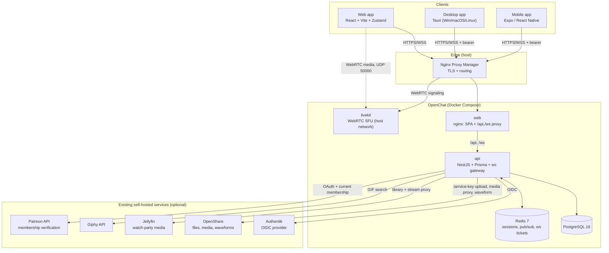
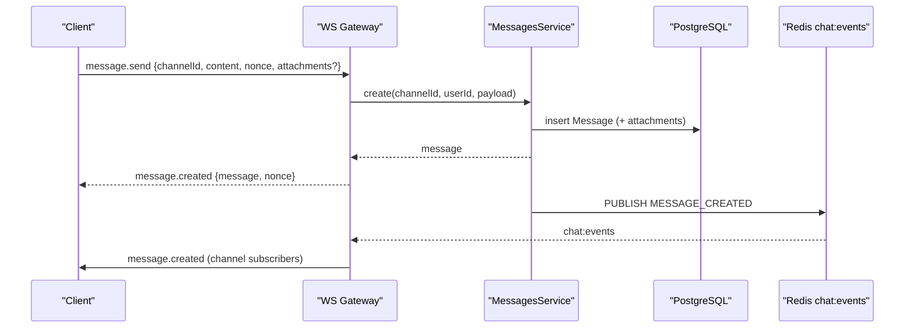
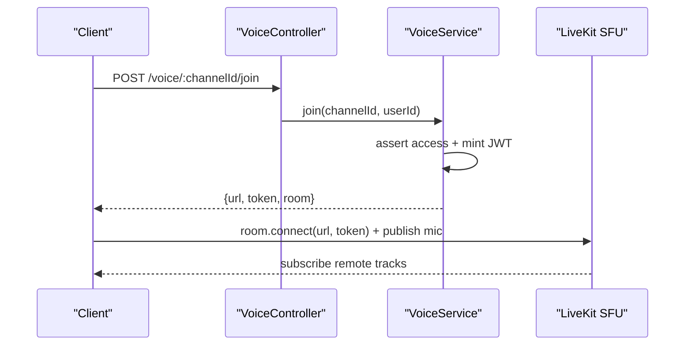

# OpenChat — Architecture

_As-built architecture of the OpenChat communication platform: a self-hosted, real-time text
+ voice/video app that **integrates** an existing self-hosted stack (Authentik for SSO,
[OpenShare](https://github.com/MinionEnjoyer/OpenShare) for files/media, Jellyfin for watch
parties) rather than reinventing them._

> Status: **as-built for the 0.8.46 production line**. This document describes what actually runs — not a proposal.
> Setup and deploy details live in [SETUP.md](SETUP.md) and [DEPLOY.md](DEPLOY.md).

## Contents
1. [Principles](#1-principles)
2. [Technology stack](#2-technology-stack)
3. [System architecture](#3-system-architecture)
4. [Authentication, sessions & permissions](#4-authentication-sessions--permissions)
5. [Realtime: WebSocket gateway, event bus & presence](#5-realtime-websocket-gateway-event-bus--presence)
6. [Voice & media (LiveKit)](#6-voice--media-livekit)
7. [Watch parties](#7-watch-parties)
8. [Files & external integrations](#8-files--external-integrations)
9. [Data model](#9-data-model)
10. [Deployment & infrastructure](#10-deployment--infrastructure)
11. [Desktop clients](#11-desktop-clients)
12. [Non-goals & notes](#12-non-goals--notes)

---

## 1. Principles

- **Integrate, don't reinvent.** Identity (Authentik/OIDC), files & previews (OpenShare), and
  watch-party media (Jellyfin) are existing services OpenChat talks to. Each is optional.
- **One config file.** Everything environment-specific (domains, IPs, keys, passwords) lives in a
  single gitignored `.env`; committed files carry only placeholders and public reference values.
- **Self-hosted & simple.** A five-service Docker Compose stack behind an existing reverse proxy.
  No cloud dependencies, no managed queues, no separate observability stack.
- **Real-time first.** A WebSocket gateway + Redis pub/sub fan-out drives messaging, presence,
  typing, mentions, watch-party sync, and call signaling; the UI is optimistic throughout.
- **Private reliability boundaries.** Optional mirror clusters use explicit peer configuration,
  HTTPS, a shared cluster key, and a PostgreSQL delivery ledger. They are not a public federation.

---

## 2. Technology stack

| Layer | Choice |
|---|---|
| **Frontend** | React 18 + TypeScript, Vite, **Zustand** (single store), `livekit-client`, react-router, TanStack Query, emoji-mart. **Inline styles + CSS variables** (Discord-like theme, `--accent #5865F2`) — no component library. Static build served by nginx. |
| **Backend** | **NestJS 11** (Express platform, Node 20), **Prisma 5**, raw **`ws`** gateway, `nestjs-pino` logging, Zod validation, Swagger at `/api/docs` when enabled. |
| **Database** | **PostgreSQL 16** via Prisma. |
| **Cache / bus / sessions** | **Redis 7** (`ioredis`): session store, pub/sub event bus, single-use WS tickets. |
| **Auth** | **Authentik** OIDC (Auth Code + PKCE) via `openid-client`; Redis-backed `express-session` cookies **and** bearer app tokens. |
| **Voice/video** | Self-hosted **LiveKit** (WebRTC SFU); `livekit-server-sdk` (JWT tokens + roster) on the server, `livekit-client` in the browser. |
| **Desktop** | **Tauri v2** shell (Windows, macOS, Linux) bundling the web build. |
| **Deploy** | Docker Compose (postgres, redis, api, web, livekit) behind an external **Nginx Proxy Manager**. |

**Deliberately not part of the stack** (to keep it lean): no BullMQ / background-job workers, no
Redis Streams or general-purpose job queue, no presigned-URL or direct-to-storage upload path, no
gRPC, no Prometheus / Grafana / Loki observability stack, no PWA service worker, and no UI
component library. Local real-time fan-out is fire-and-forget Redis pub/sub in the request path;
the optional mirror cluster has its own narrow PostgreSQL event and delivery ledger.

---

## 3. System architecture

```mermaid
graph TB
    subgraph Clients ["Clients"]
        Web["Web app<br/>React + Vite + Zustand"]
        Desktop["Desktop app<br/>Tauri (Win/macOS/Linux)"]
        Mobile["Mobile app<br/>Expo / React Native"]
    end
    subgraph Edge ["Edge (host)"]
        NPM["Nginx Proxy Manager<br/>TLS + routing"]
    end
    subgraph Stack ["OpenChat (Docker Compose)"]
        WebC["web<br/>nginx: SPA + /api,/ws proxy"]
        API["api<br/>NestJS + Prisma + ws gateway"]
        PG[("PostgreSQL 16")]
        Redis[("Redis 7<br/>sessions, pub/sub, ws tickets")]
        LK["livekit<br/>WebRTC SFU (host network)"]
    end
    subgraph External ["Existing self-hosted services (optional)"]
        Auth["Authentik<br/>OIDC provider"]
        Share["OpenShare<br/>files, media, waveforms"]
        Jelly["Jellyfin<br/>watch-party media"]
        Giphy["Giphy API"]
        Patreon["Patreon API<br/>membership verification"]
    end
    Web -->|HTTPS/WSS| NPM
    Desktop -->|HTTPS/WSS + bearer| NPM
    Mobile -->|HTTPS/WSS + bearer| NPM
    NPM --> WebC
    WebC -->|/api, /ws| API
    NPM -->|WebRTC signaling| LK
    Web -.->|WebRTC media, UDP 50000| LK
    API --> PG
    API <--> Redis
    API -->|OIDC| Auth
    API -->|service-key upload, media proxy, waveform| Share
    API -->|library + stream proxy| Jelly
    API -->|GIF search| Giphy
    API -->|OAuth + current membership| Patreon
```

**Component breakdown.**

- **`web`** — nginx serving the React SPA; also reverse-proxies `/api` and `/ws` to `api` and sets
  a `client_max_body_size 100m` so large uploads pass through.
- **`api`** — the NestJS monolith. Modules: `auth`, `servers`
  (channels/roles/members/sounds/stickers), `messages` (+reactions/pins/polls/read-state and
  server-owned member activity), `realtime` (the `ws` gateway), `share`/`media` (uploads and proxy),
  `friends`, `dms`, `invites`, `notifications`, `voice`, `watchparty`, `gifs`, `patreon`, and
  `federation`, plus global
  `prisma`, `redis`, and `presence` modules and `health`/`config` controllers. Every route is
  served both unversioned (`/api/...`) and under `/api/v1/...`.
- **`livekit`** — the SFU, on the host network for WebRTC media.
- **`postgres` / `redis`** — persistence and cache/bus/sessions.

---

## 4. Authentication, sessions & permissions

**OIDC login (Authentik, Auth Code + PKCE).** `AuthService` lazily discovers the issuer and, on
`GET /api/auth/login`, generates `state` + PKCE `code_verifier` + `nonce` (stashed in the session)
and redirects to the IdP. `GET /api/auth/callback` validates them, fetches userinfo, and **upserts
a `User` keyed by `authSub` (the OIDC subject)** — the update is intentionally empty so Chat-side
profile edits are never overwritten on re-login. A dev-login path exists but is env-gated off in
production.

**Two auth mechanisms:**
- **Browser sessions** — `express-session` backed by Redis (`connect-redis`, `sess:` prefix),
  cookie `chat.sid` (`httpOnly`, `secure` in prod, `sameSite lax`, 7-day). `trust proxy` is set for
  TLS behind NPM.
- **Bearer app tokens** — the `ApiToken` table stores only the **SHA-256 hash** of `oc_…` tokens
  (raw value shown once, in Settings → Tokens). Native/desktop clients authenticate with these.
  `GET /api/auth/desktop` mints one and hands it to the app via an `openchat://auth?token=…`
  deep link.

**`SessionGuard`** accepts, in order: an `Authorization: Bearer` token, **or a `?token=` query param**
(so ``/`<video>` media requests that can't set headers still authenticate), **or** the session
cookie. It attaches a `User` (with `authSub` stripped) to the request.

**WebSocket auth** uses short-lived single-use tickets: `GET /api/auth/ws-ticket` mints a random
value stored in Redis (`ws_ticket:<t>`, 30s TTL); the gateway verifies-and-deletes it on connect.

**Permissions** are a **BigInt bitfield** on `Role.permissions` (`ADMINISTRATOR`, `MANAGE_SERVER`,
`MANAGE_CHANNELS`, `MANAGE_ROLES`, `MANAGE_MEMBERS`, `CREATE_INVITE`, `MANAGE_MESSAGES`,
`MENTION_EVERYONE`). A member's effective permissions are the OR of their roles' bits; the server
owner implicitly has all permissions. `@here`/`@everyone` require `MENTION_EVERYONE`.

---

## 5. Realtime: WebSocket gateway, event bus & presence

**Gateway.** `EventsGateway` is a plain injectable using a raw `ws` `WebSocketServer` attached to
the same HTTP server (path `/ws?ticket=…`). The envelope is `{ op, d, id? }`; `PROTOCOL_VERSION`
is echoed in `ready`. A 30s ping loop terminates dead sockets.

- **Client → server ops:** `ping`, `subscribe {channelId}`, `unsubscribe {channelId}`,
  `message.send {channelId, content, nonce?, attachments?, replyToId?}`, `typing.start {channelId}`,
  `presence.update {status, transient?}`.
- **Server → client ops:** `ready`, `presence.snapshot`, `pong`, `message.created`,
  `message.updated`, `message.deleted`, `typing`, `presence`, `watchparty.sync`, `notify`,
  `mention`, `call.ring`.

**Event bus.** Services publish domain events to a single Redis channel, `chat:events`; the gateway
subscribes once (dedicated subscriber connection) and fans out to locally-connected sockets. This
is **fire-and-forget pub/sub** — events are not persisted or replayable. `PRESENCE_UPDATE` is
broadcast globally; `NOTIFY`/`MENTION`/`CALL_RING` are delivered to the target user's sockets;
everything else goes to sockets that `subscribe`d to the event's channel.

```mermaid
sequenceDiagram
    participant C as "Client"
    participant WS as "WS Gateway"
    participant M as "MessagesService"
    participant DB as "PostgreSQL"
    participant R as "Redis chat:events"
    C->>WS: message.send {channelId, content, nonce, attachments?}
    WS->>M: create(channelId, userId, payload)
    M->>DB: insert Message (+ attachments)
    M-->>WS: message
    WS-->>C: message.created {message, nonce}
    M->>R: PUBLISH MESSAGE_CREATED
    R-->>WS: chat:events
    WS->>C: message.created (channel subscribers)
```

`BusEvent` covers message create/update/delete, typing, presence, watch-party sync, targeted
notification/mention/call events, voice occupancy, and granular server structure events for
channels, roles, membership, and server updates/deletion. Producers span `messages`, `watchparty`,
`voice`, `friends`, `servers`, `invites`, and the gateway itself.

**Presence** lives in an **in-memory `PresenceService`** (a `Map<userId, status>`), not Redis — a
deliberate single-instance choice (a multi-instance deploy would move it to a Redis presence set +
heartbeat TTL). A user goes online when their **first** socket connects and offline when their
**last** one closes; `INVISIBLE`/appear-offline is masked to `OFFLINE` for others. On connect a
client receives a `presence.snapshot` of the current online set.

`User.status` is the saved **preference**. `presence.update` carries a `transient` flag: a manual
change persists it to the DB, while **auto-away** (a client-side 5-minute idle timer that flips
`ONLINE → AWAY` and restores on activity) is transient — it updates live presence + broadcasts
without overwriting the saved preference. Typing indicators are ephemeral `TYPING_START` events.

The web client runs the live WS connection inline in `App.tsx` with exponential-backoff reconnect
(capped 30s + jitter), re-subscribing to tracked channels and catching up missed history on
reconnect. Per-channel viewport state is stored locally as `{messageId, offset}` and restored once
after channel history is available, including for the default `general` channel.

---

## 6. Voice & media (LiveKit)

Voice rides on a self-hosted **LiveKit SFU**. `POST /api/voice/:channelId/join` asserts channel
access, reconciles a `VoiceSession` row, and mints a **LiveKit JWT** (`livekit-server-sdk`
`AccessToken`, grant `roomJoin` for `room = channelId`), returning `{ url, token, room }`. The
browser connects with `livekit-client` and publishes its mic. There is **no gRPC** — auth is JWT,
and the live roster comes from LiveKit's HTTP `RoomServiceClient` (self-healing stale DB rows).

```mermaid
sequenceDiagram
    participant C as "Client"
    participant API as "VoiceController"
    participant V as "VoiceService"
    participant LK as "LiveKit SFU"
    C->>API: POST /voice/:channelId/join
    API->>V: join(channelId, userId)
    V->>V: assert access + mint JWT
    V-->>C: {url, token, room}
    C->>LK: room.connect(url, token) + publish mic
    LK-->>C: subscribe remote tracks
```

- **Screen sharing** — `createLocalScreenTracks` publishes each shared surface as its own track
  group, so multiple monitors/windows can be shared and stopped independently; viewers receive them
  as remote video tracks.
- **Soundboard** — a per-server **library** of sound URLs (`ServerSound` model + CRUD); playing a
  clip decodes it into a dedicated published WebAudio track named `soundboard` so everyone in the
  room hears it (and it can be muted independently of voices).
- **Input modes (PTT / voice-activity)** — the published mic track is muted/unmuted (never
  re-published) based on `!hardMuted && (mode === 'vad' || pttHeld)`. Push-to-talk uses an in-app
  keydown/up handler plus, on desktop, a **global shortcut** (works unfocused).
- **DM calls** — joining a DM voice channel emits a `CALL_RING` event so absent recipients get an
  incoming-call prompt.

---

## 7. Watch parties

A host-synced shared player inside a voice channel, backed by the `WatchParty` model
(`hostId, positionMs, paused`, plus a ref column). Every play/pause/seek by the host is persisted
and broadcast as `WATCHPARTY_SYNC` over the bus; followers apply the shared position/paused state
(resyncing if they drift > ~1.5s). Only the host may change state or end the party.

**Two sources, one column.** The ref is stored in `jellyfinItemId` with a prefix (no schema
change): `yt:<id>` = YouTube, `ja:<id>` = Jellyfin **audio**, anything else = Jellyfin **video**.

- **Jellyfin** — the player is a `<video>` pointed at the API stream proxy
  (`/api/watchparty/stream/<id>[?kind=audio]`), which fetches from Jellyfin with the API key and
  pipes back (key stays server-side). The picker searches the library with **movie / show / music**
  filters.
- **YouTube** — the player embeds a small shim page (`public/yt-party.html`) served from the app's
  **https origin** and drives it over `postMessage`. The shim wraps the **YouTube IFrame Player
  API**; it exists because the desktop app's `tauri://localhost` origin is rejected by YouTube
  (error 153), so the iframe is loaded from the real https origin. Followers get a locked player
  (no controls) that starts muted for reliable autoplay, with a custom Unmute button; the host
  drives playback.

The player header shows a host badge and a viewers list (voice-channel participants).

---

## 8. Files & external integrations

**Uploads (OpenShare).** All uploads — message attachments, avatars, soundboard sounds, stickers,
and server icons — go through authenticated **`POST /api/uploads`**. API file-count and per-file
limits are opt-in through `UPLOAD_MAX_FILES` and `UPLOAD_MAX_FILE_BYTES`; unset means unlimited at
that layer. The bundled nginx still has a 100 MB request-body ceiling unless the operator changes
it, and an external reverse proxy can impose its own ceiling.

`ShareService.uploadForUser` uploads one asset per server-to-server request to OpenShare's stable
`/api/assets` contract with `Authorization: Bearer <SHARE_API_KEY>`, `X-Share-User-Sub`, and
`X-Share-User-Name`. A `/upload` fallback supports older OpenShare installs; neither route uses
OpenShare dev-login. There is **no presigned-URL / direct-to-storage / S3 path**.

Attachments return same-origin `/api/media/<id>/raw` and `/api/media/<id>/thumb` URLs. Those
authenticated endpoints stream OpenShare content and preserve Range/cache headers. Native clients
use the configured server origin and bearer/query-token media authentication; browser clients use
the same-origin session. Waveform analysis similarly goes through `POST /api/uploads/waveform`.

**Jellyfin.** Library search maps the filter to `IncludeItemTypes` (`Movie` / `Episode` / `Audio`)
and rewrites poster URLs to the API proxy; poster and stream endpoints both attach `X-Emby-Token`
server-side and stream back (with HTTP Range support).

**Giphy.** `GET /api/gifs/search` proxies Giphy search/trending with the server-held `GIPHY_API_KEY`.

**Patreon.** When the host opts in, a server owner stores a campaign ID and minimum current support
amount in `PatreonGate`. A public join URL begins Patreon OAuth with a random, ten-minute Redis
state. The callback performs a live membership lookup, does not persist the Patreon access token,
and issues an atomic one-use OpenChat invite that expires after one hour. This is initial-access
verification, not continuous entitlement enforcement. See
[Patreon invitations](guides/PATREON_INVITES.md).

**Trusted mirror cluster.** An operator can explicitly configure private HTTPS peers with a shared
32-or-more-character cluster secret. Message create/edit/delete events are HMAC-authenticated,
idempotently persisted in `FederationEvent`, and retried from `FederationDelivery` with bounded
backoff. This is separate from the local Redis real-time bus and is not public federation. See
[trusted mirror clusters](guides/TRUSTED_MIRROR_CLUSTER.md).

---

## 9. Data model

Prisma over PostgreSQL. Enums: `ChannelType` (TEXT/VOICE/ANNOUNCEMENT/DM/GROUP_DM),
`FriendStatus` (PENDING/ACCEPTED/BLOCKED), `ServerInviteStatus`, `UserStatus`
(ONLINE/AWAY/DND/INVISIBLE/OFFLINE). Core models:

- **Identity** — `User` (keyed by `authSub`; `status` is the saved presence preference;
  `serverLayout` Json is the per-user server-rail layout), `ApiToken` (SHA-256 hashes only).
- **Servers** — `Server`, `ServerMember` (m:n `Role[]`), `Role` (BigInt `permissions` bitfield),
  `Category`, `Channel` (self-relation for threads; `serverId = null` ⇒ DM/group DM), `ServerSound`,
  `ServerSticker`,
  `Invite` (code-based), `ServerInvitation` (direct user-to-user), `PatreonGate`, and `AuditLog`.
- **Messaging** — `Message` (soft-delete, replies, pins, and `MessageKind` system activity),
  `MessageAttachment`, `Reaction`, `Poll`
  → `PollOption` → `PollVote`, `ReadState` (per-user-per-channel unread + mention counts).
- **DMs & social** — `ChannelRecipient` (participants of DM/group-DM channels), `Friendship` (one
  directional row covers both request and accepted friendship).
- **Voice & watch party** — `VoiceSession`, `WatchParty` (the `jellyfinItemId` ref column encodes
  the source via `yt:`/`ja:` prefixes).
- **Private replication** — `FederationEvent` stores the signed event ledger and
  `FederationDelivery` stores durable per-peer retry state.

---

## 10. Deployment & infrastructure

**Docker Compose — exactly five services:** `postgres` (16-alpine, healthcheck, `pg_data`),
`redis` (7-alpine, appendonly, `redis_data`), `api` (NestJS, port 3001; `extra_hosts` pin the
Authentik/Jellyfin/Share/Chat domains to `LAN_HOST_IP` for server-side calls), `web` (nginx,
published on `${WEB_PORT:-8810}`), and `livekit` (`network_mode: host` for WebRTC, mounts the
rendered `livekit.yaml`). Bridge network `app_net`. **No** Prometheus/Grafana/Loki/Promtail/BullMQ
services.

**Reverse proxy** is an **external Nginx Proxy Manager** (not in the compose): it terminates TLS
and routes the chat domain → the `web` container, and the LiveKit domain → the SFU signaling port.
Forwarded proto is passed through for Secure cookies. `apps/web/nginx.conf` serves the SPA
(`try_files … /index.html`), proxies `/api` → `api:3001` and `/ws` (with WebSocket upgrade +
long read timeout), and currently sets `client_max_body_size 100m`. The API itself has no default
upload limit; adjust this nginx value and the external proxy together when an instance permits
larger requests.

**LiveKit config** (`livekit.yaml.tmpl`, rendered from `.env` by `scripts/setup.sh`): a
**single-UDP-port mux** (`rtc.udp_port: 50000`, TCP fallback `7881`, signaling `7880`) for NAT
stability, with `node_ip = LIVEKIT_NODE_IP`. The rendered `livekit.yaml` is gitignored.

**Config & secrets.** One gitignored `.env` holds all real values; `scripts/check-secrets.sh`
guards against committing them. **Git-based deploy** (`scripts/deploy.sh`): `git pull --ff-only`
→ `docker compose up -d --build` → prune. The API container **auto-applies migrations on boot**
(`npx prisma migrate deploy && node dist/main.js`), so `.env` and the DB survive every deploy.

---

## 11. Desktop clients

A **Tauri v2** shell (`apps/desktop`) bundles the web build (`apps/web/dist`) for **Windows,
macOS, and Linux**. Per-platform config is auto-merged (`tauri.conf.json` base/Windows NSIS,
`tauri.macos.conf.json` → dmg/app with native chrome, `tauri.linux.conf.json` → AppImage + deb).
Windows/Linux use a frameless custom title bar; macOS keeps native chrome.

Native features via small Rust commands + plugins: OS **notifications**, **system tray** +
close-to-tray, **global push-to-talk** (`register_ptt`/`unregister_ptt` → emits `ptt://down|up`),
**drag-and-drop** uploads (Tauri's own drop capture disabled so the webview handles it), **browser
SSO** via `openchat://` deep links (with a manual app-token fallback), and signed **auto-update**
(minisign-signed artifacts, `latest.json` on the GitHub release; AppImage updates in place, `.deb`
is a manual install). Clients authenticate with a bearer app token against a configurable server
URL — no browser cookie. See [apps/desktop/README.md](../apps/desktop/README.md).

The web UI also exposes Settings → Servers, using the same remembered-domain/token store as the
desktop shell. The mobile app uses the same HTTP/WebSocket contracts with a production
system-browser OIDC Authorization Code + PKCE flow and rotating bearer/refresh tokens.

---

## 12. Non-goals & notes

- **Single API instance.** Presence is in-memory and the event bus is fire-and-forget, so the API
  is designed to run as one instance. Horizontal scaling would need a Redis presence set (with
  heartbeat TTL) and is not implemented.
- **No message replay / outbox.** Bus events aren't persisted; missed real-time events are
  reconciled by re-fetching on reconnect, not replayed. The optional mirror cluster persists only
  cross-host message replication and does not turn the local WebSocket bus into a replay stream.
- **Optional integrations degrade gracefully.** With OpenShare unset, upload UI hides; without
  Jellyfin, watch parties fall back to YouTube; without Giphy, the GIF picker hides; without
  Patreon OAuth, membership-gate controls explain that host configuration is required.
- **Not code-signed.** Desktop builds aren't OS-code-signed (updater signing is separate), so
  first launch shows a trust prompt per platform.
